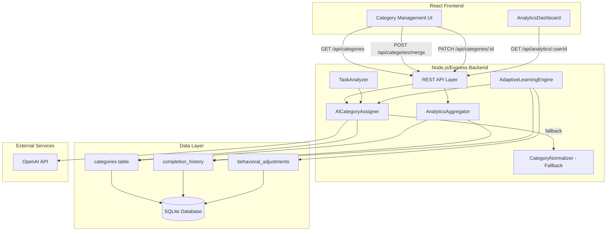
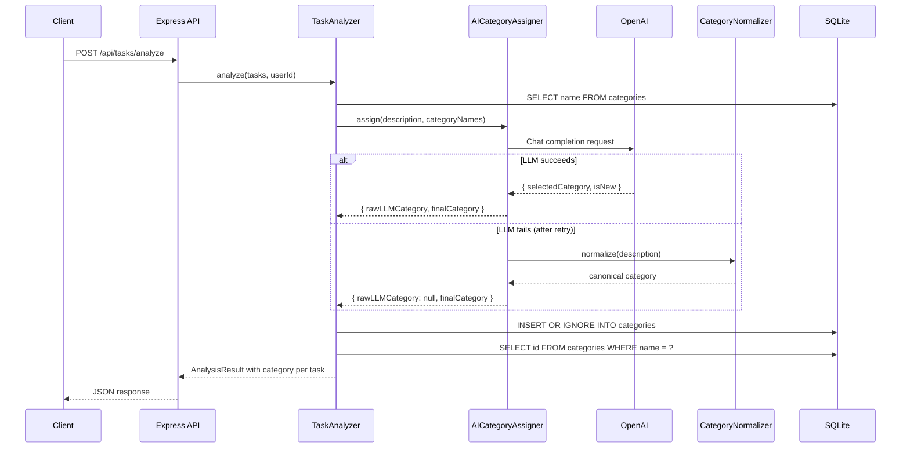
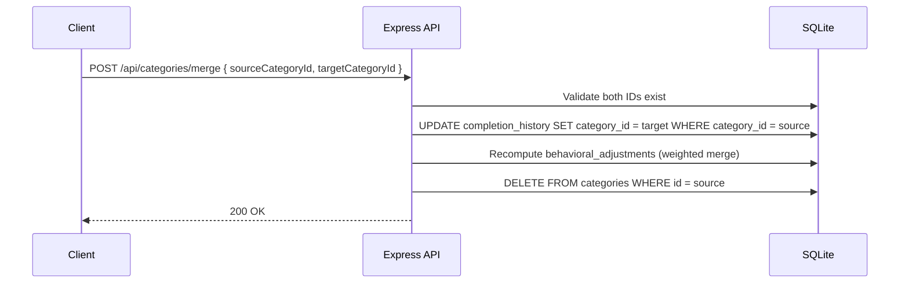
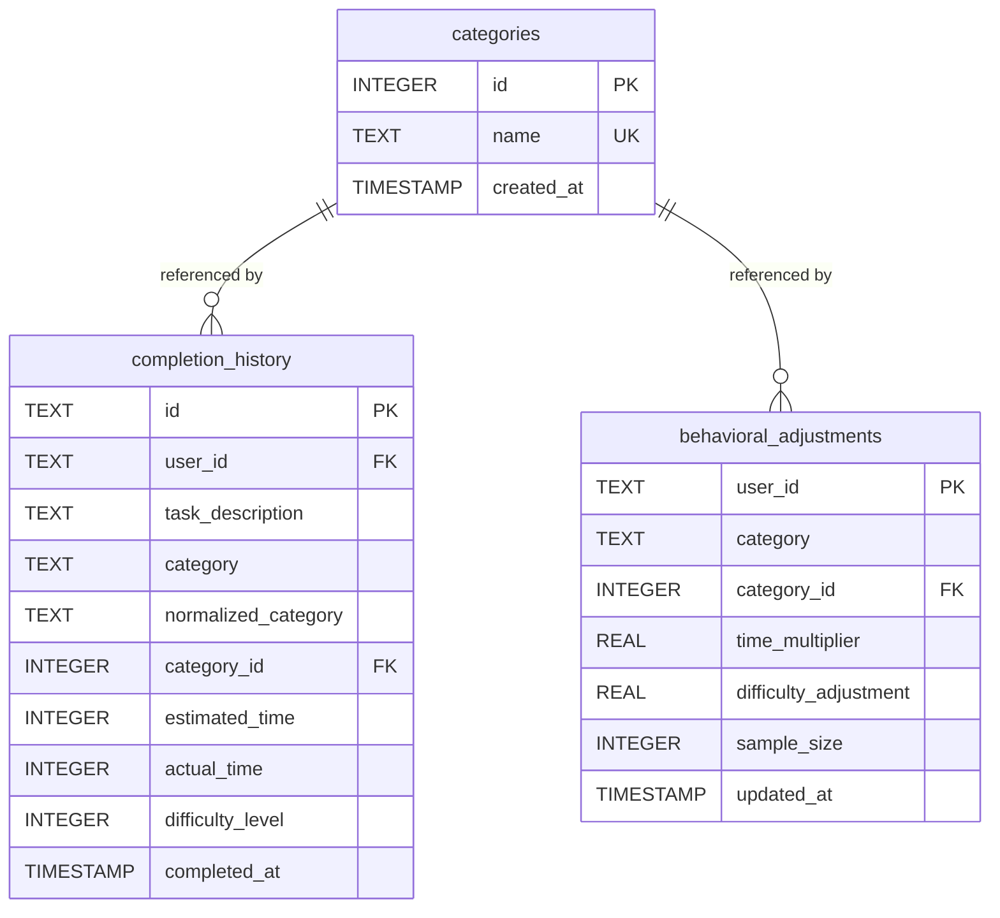

# Design Document: AI Category Assignment

## Overview

This feature replaces the static keyword-based category normalization (`category-normalizer.ts`) with an AI-assisted category assignment flow. When a task is analyzed or a completion is recorded, the system sends the task description along with the user's existing category list to the LLM, which selects the best-fitting existing category or proposes a short, reusable new one. Categories become first-class entities in a dedicated `categories` table with stable integer IDs, enabling consistent references across `completion_history`, `behavioral_adjustments`, analytics, and adaptive learning. The existing keyword normalizer is retained as a synchronous fallback when the LLM is unavailable.

### Key Design Decisions

1. **Categories as first-class entities**: A dedicated `categories` table with auto-incrementing integer primary keys replaces free-text category strings. All foreign references (`completion_history.category_id`, `behavioral_adjustments.category_id`) point to this table, enabling merge and rename operations without data loss.

2. **AI-first, keyword-fallback**: The new `AICategoryAssigner` service calls the LLM with the task description and the full list of existing category names. If the LLM fails after one retry, the service falls back to the existing `normalize()` function from `category-normalizer.ts`. This preserves reliability while improving accuracy.

3. **Reuse of existing OpenAI integration pattern**: The `AICategoryAssigner` follows the same LLM interaction pattern established in `TaskAnalyzer` and `TaskInputParser` — system prompt, JSON response parsing, retry with stricter prompt, graceful fallback. It accepts an injected `OpenAI` client for testability.

4. **Non-destructive migration**: The schema migration adds the `categories` table and `category_id` columns without dropping or altering existing columns. Existing `category` and `normalized_category` text columns are preserved for backward compatibility. A backfill step populates `category_id` for existing rows.

5. **Category explosion prevention via prompt engineering**: The LLM prompt explicitly instructs the model to prefer existing categories. When the category count exceeds 30, an additional instruction emphasizes that new categories should only be created in exceptional cases.

6. **Merge recomputes adjustments**: When merging categories, `behavioral_adjustments` rows are combined by computing a weighted average of `time_multiplier` based on `sample_size`, ensuring statistical accuracy.

## Architecture



### Data Flow — Task Analysis with Category Assignment



### Data Flow — Category Merge



## Components and Interfaces

### AICategoryAssigner (New Service)

**File**: `server/src/services/ai-category-assigner.ts`

```typescript
interface CategoryAssignmentResult {
  /** The raw string returned by the LLM, or null if fallback was used */
  rawLLMCategory: string | null;
  /** The resolved category name (existing or newly created) */
  finalCategory: string;
  /** Whether the LLM proposed a new category (not in the existing list) */
  isNew: boolean;
}

class AICategoryAssigner {
  constructor(client?: OpenAI, model?: string);

  /**
   * Assign a category to a task description.
   * @param description - The task description text
   * @param existingCategories - Current category names from the categories table
   * @returns The assignment result with raw LLM output and resolved category
   */
  async assign(
    description: string,
    existingCategories: string[],
  ): Promise<CategoryAssignmentResult>;
}
```

**Behavior**:

- Builds a system prompt instructing the LLM to select from `existingCategories` or propose a new short, title-cased, general-purpose label (max 3 words).
- When `existingCategories.length > 30`, appends an additional instruction emphasizing reuse.
- Expects JSON response: `{ "category": "...", "isExisting": true/false }`.
- On parse failure, retries once with a stricter prompt.
- On total failure, falls back to `normalize(description)` from `category-normalizer.ts` and logs a warning.

### CategoryRepository (New Data Access)

**File**: `server/src/db/category-repository.ts`

```typescript
interface CategoryEntity {
  id: number;
  name: string;
  createdAt: string;
}

class CategoryRepository {
  constructor(db: Database.Database);

  /** Get all categories ordered by name */
  getAll(): CategoryEntity[];

  /** Get all category names as a string array */
  getAllNames(): string[];

  /** Find a category by name (case-insensitive) */
  findByName(name: string): CategoryEntity | null;

  /** Find a category by ID */
  findById(id: number): CategoryEntity | null;

  /** Insert a new category, returning the entity. No-op if name exists. */
  upsertByName(name: string): CategoryEntity;

  /** Rename a category. Throws on duplicate name or missing ID. */
  rename(id: number, newName: string): CategoryEntity;

  /** Delete a category by ID */
  delete(id: number): void;
}
```

### Modified: TaskAnalyzer

**Changes**:

- Constructor accepts an `AICategoryAssigner` instance.
- `analyze()` fetches category names from `CategoryRepository`, calls `AICategoryAssigner.assign()` for each task, resolves/creates the category in the table, and includes `category` and `categoryId` in the returned `AnalyzedTask`.

### Modified: AdaptiveLearningEngine

**Changes**:

- `recordCompletion()` calls `AICategoryAssigner.assign()` (or receives the category from the caller) to get a `categoryId`, stores it on the `completion_history` row.
- `getBehavioralModel()` groups by `category_id` and joins `categories` to get display names.
- Behavioral adjustments are keyed by `category_id` instead of raw text.

### Modified: AnalyticsAggregator

**Changes**:

- All queries that currently group by `category` or `normalized_category` switch to grouping by `category_id` with a JOIN to `categories` for the display name.
- `getPerformanceCategories()`, `computeCategoryPerformance()`, `findMostDelayedCategory()`, `findTopImprovingCategory()`, `computeRecentChanges()`, and `computeWeeklyByCategory()` all updated.

### New API Endpoints

| Method  | Path                          | Description                         |
| ------- | ----------------------------- | ----------------------------------- |
| `GET`   | `/api/categories`             | List all categories ordered by name |
| `POST`  | `/api/categories/merge`       | Merge source category into target   |
| `PATCH` | `/api/categories/:categoryId` | Rename a category                   |

### Modified Types

```typescript
// server/src/types/index.ts additions

interface CategoryEntity {
  id: number;
  name: string;
  createdAt: string;
}

interface CategoryAssignmentResult {
  rawLLMCategory: string | null;
  finalCategory: string;
  isNew: boolean;
}

// Extended AnalyzedTask
interface AnalyzedTask extends ParsedTask {
  metrics: TaskMetrics;
  category?: string; // Final category name
  categoryId?: number; // Foreign key to categories table
}
```

## Data Models

### New Table: `categories`

| Column       | Type      | Constraints                       |
| ------------ | --------- | --------------------------------- |
| `id`         | INTEGER   | PRIMARY KEY AUTOINCREMENT         |
| `name`       | TEXT      | NOT NULL, UNIQUE (COLLATE NOCASE) |
| `created_at` | TIMESTAMP | DEFAULT CURRENT_TIMESTAMP         |

**Seed data**: Writing, Development, Design, Research, Admin, Communication, Planning, Testing, Learning, Other.

### Modified Table: `completion_history`

New column:

| Column        | Type    | Constraints                             |
| ------------- | ------- | --------------------------------------- |
| `category_id` | INTEGER | REFERENCES categories(id), DEFAULT NULL |

Existing `category` and `normalized_category` columns are preserved.

### Modified Table: `behavioral_adjustments`

New column:

| Column        | Type    | Constraints                             |
| ------------- | ------- | --------------------------------------- |
| `category_id` | INTEGER | REFERENCES categories(id), DEFAULT NULL |

Existing `category` text column is preserved during migration. New rows will use `category_id` as the primary grouping key.

### Migration Strategy

The migration runs inside `runMigrations()` in `schema.ts`:

1. **Create `categories` table** (IF NOT EXISTS).
2. **Seed canonical categories** — INSERT OR IGNORE the 10 default categories.
3. **Add `category_id` to `completion_history`** — ALTER TABLE if column doesn't exist.
4. **Backfill `completion_history.category_id`** — UPDATE rows by matching `normalized_category` against `categories.name`.
5. **Add `category_id` to `behavioral_adjustments`** — ALTER TABLE if column doesn't exist.
6. **Backfill `behavioral_adjustments.category_id`** — UPDATE rows by matching `category` against `categories.name`.

All steps are idempotent and non-destructive.

### Entity Relationship Diagram



## Correctness Properties

_A property is a characteristic or behavior that should hold true across all valid executions of a system — essentially, a formal statement about what the system should do. Properties serve as the bridge between human-readable specifications and machine-verifiable correctness guarantees._

### Property 1: Case-insensitive category uniqueness

_For any_ two category name strings that differ only in letter casing, inserting both into the categories table SHALL result in only one row, with the second insert being a no-op or raising a uniqueness violation.

**Validates: Requirements 1.3**

### Property 2: Prompt construction includes description and all categories

_For any_ task description and _for any_ list of existing category names, the prompt sent to the LLM SHALL contain the task description and every category name from the list. Additionally, _for any_ category list with more than 30 entries, the prompt SHALL contain an additional instruction emphasizing category reuse.

**Validates: Requirements 2.1, 11.2, 11.3**

### Property 3: Category assignment returns correct result for LLM responses

_For any_ LLM response that selects an existing category from the provided list, the `finalCategory` SHALL equal that category name and `isNew` SHALL be false. _For any_ LLM response that proposes a new category name not in the provided list, the `finalCategory` SHALL equal the proposed name and `isNew` SHALL be true. In both cases, `rawLLMCategory` SHALL equal the LLM's returned category string.

**Validates: Requirements 2.2, 2.3, 2.6**

### Property 4: Fallback produces normalizer result with null raw category

_For any_ task description, when the LLM call fails (error, timeout, or empty response) after the retry attempt, the `finalCategory` SHALL equal the result of `normalize(description)` from the keyword normalizer, and `rawLLMCategory` SHALL be `null`.

**Validates: Requirements 3.1, 3.2, 3.3**

### Property 5: Category resolution is idempotent

_For any_ category name, resolving it against the categories table SHALL return a valid `CategoryEntity` with a positive integer `id`. Resolving the same name a second time SHALL return the same `id`. If the name did not previously exist, a new row SHALL be created; if it did exist, the existing row SHALL be returned.

**Validates: Requirements 4.1, 4.2**

### Property 6: Completion records store both raw category and category_id

_For any_ completion record inserted via the AdaptiveLearningEngine, the resulting `completion_history` row SHALL have a non-null `category_id` that references a valid row in the categories table, and the `category` text column SHALL also be populated.

**Validates: Requirements 4.4, 6.1**

### Property 7: Migration backfill populates category_id from text columns

_For any_ existing `completion_history` row whose `normalized_category` matches a seeded category name, and _for any_ existing `behavioral_adjustments` row whose `category` text matches a seeded category name, the migration backfill SHALL set `category_id` to the corresponding `categories.id`.

**Validates: Requirements 4.6, 6.4**

### Property 8: Task analysis assigns a category to every task

_For any_ non-empty list of parsed tasks, after analysis by the TaskAnalyzer, every returned `AnalyzedTask` SHALL include a `category` string that is a valid category name present in the categories table.

**Validates: Requirements 5.1, 5.3**

### Property 9: Behavioral adjustments group by category_id

_For any_ set of completion records that share the same `category_id` but have different raw `category` text values, the AdaptiveLearningEngine SHALL produce a single behavioral adjustment entry keyed by that `category_id`, with `sample_size` equal to the total number of those records.

**Validates: Requirements 6.2**

### Property 10: Analytics groups by category_id and returns display name

_For any_ set of completion records sharing the same `category_id`, the AnalyticsAggregator SHALL group them together in category performance statistics, and the returned category label SHALL equal the current `name` from the categories table (reflecting any renames).

**Validates: Requirements 7.1, 7.2, 7.3**

### Property 11: Merge transfers all references and deletes source

_For any_ two distinct category IDs (source and target) where both exist in the categories table, after a merge operation: (a) no `completion_history` rows SHALL reference the source `category_id`, (b) no `behavioral_adjustments` rows SHALL reference the source `category_id`, and (c) the source category SHALL no longer exist in the categories table.

**Validates: Requirements 8.1, 8.3**

### Property 12: Merge recomputes behavioral adjustments as weighted average

_For any_ two behavioral adjustment rows being merged (source with `time_multiplier_s`, `sample_size_s` and target with `time_multiplier_t`, `sample_size_t`), the resulting merged row's `time_multiplier` SHALL equal `(time_multiplier_s × sample_size_s + time_multiplier_t × sample_size_t) / (sample_size_s + sample_size_t)` and `sample_size` SHALL equal `sample_size_s + sample_size_t`.

**Validates: Requirements 8.2**

### Property 13: Rename updates label and preserves all references

_For any_ category ID that exists in the categories table and _for any_ new name that does not conflict with an existing name, after a rename operation: (a) the category row's `name` SHALL equal the new name, and (b) all `completion_history` and `behavioral_adjustments` rows that referenced that `category_id` before the rename SHALL still reference the same `category_id`.

**Validates: Requirements 9.1, 9.4**

### Property 14: Rename rejects duplicate names case-insensitively

_For any_ two categories in the table, attempting to rename one to a case-variant of the other's name SHALL result in an error, and neither category SHALL be modified.

**Validates: Requirements 9.2**

## Error Handling

### LLM Failures

| Scenario                                                | Behavior                                                                         |
| ------------------------------------------------------- | -------------------------------------------------------------------------------- |
| LLM returns unparseable JSON                            | Retry once with stricter prompt; if still fails, fall back to keyword normalizer |
| LLM call throws (network error, auth error)             | Retry once; if still fails, fall back to keyword normalizer                      |
| LLM returns empty response                              | Retry once; if still fails, fall back to keyword normalizer                      |
| LLM returns a category name that is empty or whitespace | Treat as failure, fall back to keyword normalizer                                |

All fallback activations log a warning with the error reason via `console.warn`.

### Category Management Errors

| Scenario                                            | HTTP Status | Error Message                                                 |
| --------------------------------------------------- | ----------- | ------------------------------------------------------------- |
| Merge: source ID = target ID                        | 400         | "Cannot merge a category with itself"                         |
| Merge: source ID not found                          | 404         | "Source category not found"                                   |
| Merge: target ID not found                          | 404         | "Target category not found"                                   |
| Rename: category ID not found                       | 404         | "Category not found"                                          |
| Rename: new name conflicts (case-insensitive)       | 409         | "A category with this name already exists"                    |
| Rename: empty or missing name                       | 400         | "Missing required field: name"                                |
| Merge: missing sourceCategoryId or targetCategoryId | 400         | "Missing required fields: sourceCategoryId, targetCategoryId" |

### Database Errors

- All database operations that modify multiple tables (merge, completion recording) use SQLite transactions to ensure atomicity.
- Migration steps are idempotent — re-running them on an already-migrated database is a no-op.

## Testing Strategy

### Property-Based Tests (fast-check)

The project already uses `fast-check` (see `server/package.json`). Each correctness property above maps to a property-based test with a minimum of 100 iterations.

**Test file**: `server/src/services/__tests__/ai-category-assigner.property.test.ts`

Tests for Properties 1–5 (category uniqueness, prompt construction, assignment results, fallback, resolution):

- Generate random category names (alphanumeric strings, unicode, mixed case)
- Generate random task descriptions
- Mock the OpenAI client to return controlled responses
- Verify invariants hold across all generated inputs

**Test file**: `server/src/services/__tests__/category-merge.property.test.ts`

Tests for Properties 11–12 (merge transfers references, weighted average):

- Generate random completion records and behavioral adjustments across two categories
- Execute merge and verify all references transferred and weighted averages correct

**Test file**: `server/src/services/__tests__/category-rename.property.test.ts`

Tests for Properties 13–14 (rename preserves references, rejects duplicates):

- Generate random category names and rename targets
- Verify reference preservation and duplicate detection

**Test file**: `server/src/services/__tests__/category-integration.property.test.ts`

Tests for Properties 6–10 (completion storage, backfill, task analysis, behavioral grouping, analytics grouping):

- Use in-memory SQLite databases
- Generate random completion records and verify category_id storage and grouping

**Tag format**: `Feature: ai-category-assignment, Property {N}: {title}`

### Unit Tests (example-based)

**Test file**: `server/src/services/__tests__/ai-category-assigner.test.ts`

- LLM selects existing category "Development" → returns correct result
- LLM proposes new category "Data Entry" → returns correct result
- LLM returns invalid JSON → retries with stricter prompt
- LLM fails twice → falls back to keyword normalizer
- Prompt contains instruction to prefer existing categories (Req 2.4, 2.5)
- Prompt contains formatting constraints for new categories
- Fallback logs a warning (Req 3.4)

**Test file**: `server/src/db/__tests__/category-repository.test.ts`

- `getAll()` returns categories sorted by name
- `upsertByName()` creates new category
- `upsertByName()` returns existing category on duplicate
- `rename()` updates name
- `rename()` throws on duplicate name
- `findByName()` is case-insensitive

**Test file**: `server/src/__tests__/category-api.test.ts`

- `GET /api/categories` returns sorted list
- `POST /api/categories/merge` with valid IDs succeeds
- `POST /api/categories/merge` with same source/target returns 400
- `POST /api/categories/merge` with missing source returns 404
- `PATCH /api/categories/:id` with valid name succeeds
- `PATCH /api/categories/:id` with duplicate name returns 409
- `PATCH /api/categories/:id` with non-existent ID returns 404
- All endpoints return 400 for missing/invalid parameters

**Test file**: `server/src/db/__tests__/schema.test.ts` (extend existing)

- Migration creates categories table with correct columns
- Migration seeds 10 canonical categories
- Migration adds category_id to completion_history
- Migration backfills category_id for existing rows
- Migration is idempotent (running twice is safe)

### Integration Tests

- End-to-end flow: parse → analyze → complete → verify category persisted with category_id
- Merge flow: create completions across two categories → merge → verify analytics groups correctly
- Rename flow: rename category → verify analytics returns new name
