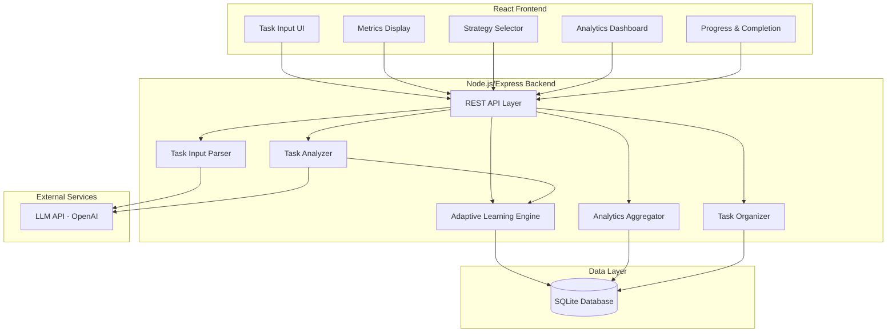
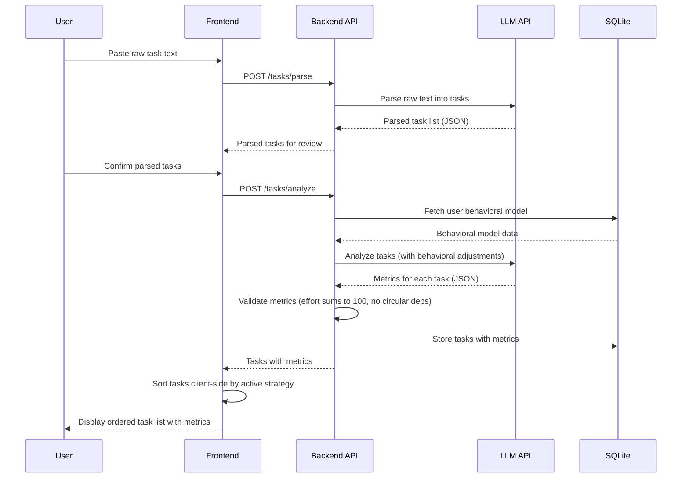

# Design Document: AI Daily Task Planner

## Overview

The AI Daily Task Planner is a full-stack application that transforms unstructured task input into an intelligently prioritized daily plan. The system uses AI (via an LLM API) to parse raw text into discrete tasks, assign quantitative metrics, detect dependencies, and order tasks according to user-selected strategies. An adaptive learning engine refines predictions over time based on actual completion data, and an analytics dashboard surfaces productivity insights.

The application is built as a TypeScript project using React for the frontend and a lightweight Node.js/Express backend. Task analysis and metric assignment are delegated to an external LLM API (e.g., OpenAI). User data, preferences, and completion history are persisted in a local SQLite database for simplicity, with the option to swap in a cloud database later.

### Key Design Decisions

1. **LLM for parsing and analysis**: Rather than building custom NLP, we delegate task parsing, metric assignment, and dependency detection to an LLM via structured prompts with JSON schema enforcement. This gives us flexibility and accuracy on unstructured input without training a custom model.

2. **Client-side sorting**: Prioritization strategies are pure functions operating on in-memory task arrays. This keeps re-ordering instant (well under the 2-second requirement) and avoids unnecessary API calls when the user switches strategies.

3. **SQLite for persistence**: A local SQLite database keeps the system self-contained and easy to set up. The schema is designed so it can be migrated to PostgreSQL or another database with minimal changes.

4. **Separation of AI and deterministic logic**: AI handles subjective analysis (parsing, metrics). Deterministic logic handles sorting, dependency graph validation, and analytics aggregation. This makes the deterministic parts fully testable without mocking AI.

## Architecture



### Request Flow



## Components and Interfaces

### 1. Task Input Parser (`TaskInputParser`)

Receives raw text and delegates to the LLM to split it into discrete tasks.

```typescript
interface ParsedTask {
  id: string;
  rawText: string;
  description: string;
  isAmbiguous: boolean;
  splitFrom?: string; // ID of compound task this was split from
}

interface ParseResult {
  tasks: ParsedTask[];
  ambiguousItems: ParsedTask[];
  errors: string[];
}

interface TaskInputParser {
  parse(rawText: string): Promise<ParseResult>;
}
```

### 2. Task Analyzer (`TaskAnalyzer`)

Assigns metrics to each confirmed task using the LLM, incorporating behavioral model adjustments from the Adaptive Learning Engine.

```typescript
interface TaskMetrics {
  priority: number; // 1-5
  effortPercentage: number; // 0-100, all tasks sum to 100
  difficultyLevel: number; // 1-5
  estimatedTime: number; // minutes
  dependsOn: string[]; // IDs of tasks this depends on
}

interface AnalyzedTask extends ParsedTask {
  metrics: TaskMetrics;
}

interface CircularDependencyError {
  cycle: string[]; // task IDs forming the cycle
  message: string;
}

interface AnalysisResult {
  tasks: AnalyzedTask[];
  circularDependencies: CircularDependencyError[];
}

interface TaskAnalyzer {
  analyze(tasks: ParsedTask[], userId: string): Promise<AnalysisResult>;
}
```

### 3. Task Organizer (`TaskOrganizer`)

Pure, deterministic sorting of analyzed tasks by strategy. Runs client-side for instant re-ordering.

```typescript
type PrioritizationStrategy =
  | "least-effort-first"
  | "hardest-first"
  | "highest-priority-first"
  | "dependency-aware";

interface TaskOrganizer {
  order(
    tasks: AnalyzedTask[],
    strategy: PrioritizationStrategy,
  ): AnalyzedTask[];
}
```

### 4. Adaptive Learning Engine (`AdaptiveLearningEngine`)

Tracks completion data and produces adjustment factors for the Task Analyzer.

```typescript
interface CompletionRecord {
  taskId: string;
  userId: string;
  description: string;
  estimatedTime: number;
  actualTime: number;
  difficultyLevel: number;
  completedAt: Date;
}

interface BehavioralModel {
  userId: string;
  totalCompletedTasks: number;
  adjustments: CategoryAdjustment[];
}

interface CategoryAdjustment {
  category: string;
  timeMultiplier: number; // < 1 means user is faster, > 1 means slower
  difficultyAdjustment: number; // negative means easier, positive means harder
  sampleSize: number;
}

interface AdaptiveLearningEngine {
  recordCompletion(record: CompletionRecord): Promise<void>;
  getBehavioralModel(userId: string): Promise<BehavioralModel>;
  resetModel(userId: string): Promise<void>;
}
```

### 5. Analytics Aggregator (`AnalyticsAggregator`)

Queries completion history and computes dashboard metrics.

```typescript
interface DailyCompletionStat {
  date: string;
  tasksCompleted: number;
  avgActualTime: number;
  avgEstimatedTime: number;
}

interface DifficultyBreakdown {
  difficultyLevel: number;
  count: number;
}

interface PerformanceCategory {
  category: string;
  avgActualTime: number;
  avgEstimatedTime: number;
  label: "strength" | "area-for-improvement";
}

interface AnalyticsSummary {
  dailyStats: DailyCompletionStat[];
  difficultyBreakdown: DifficultyBreakdown[];
  performanceCategories: PerformanceCategory[];
  dailyProgressPercent: number;
  insufficientData: boolean;
}

interface AnalyticsAggregator {
  getSummary(
    userId: string,
    startDate: string,
    endDate: string,
  ): Promise<AnalyticsSummary>;
  getDailyProgress(userId: string, date: string): Promise<number>;
}
```

### 6. Preference Profile Store (`PreferenceProfileStore`)

Persists and retrieves user prioritization preferences.

```typescript
interface PreferenceProfile {
  userId: string;
  strategy: PrioritizationStrategy;
  updatedAt: Date;
}

interface PreferenceProfileStore {
  get(userId: string): Promise<PreferenceProfile | null>;
  save(userId: string, strategy: PrioritizationStrategy): Promise<void>;
}
```

### REST API Endpoints

| Method | Path                          | Description                             |
| ------ | ----------------------------- | --------------------------------------- |
| POST   | `/api/tasks/parse`            | Parse raw text into task list           |
| POST   | `/api/tasks/analyze`          | Analyze confirmed tasks, assign metrics |
| GET    | `/api/tasks/:sessionId`       | Get tasks for a session                 |
| PATCH  | `/api/tasks/:taskId/complete` | Mark task as complete with actual time  |
| GET    | `/api/preferences/:userId`    | Get user preference profile             |
| PUT    | `/api/preferences/:userId`    | Update user preference profile          |
| GET    | `/api/analytics/:userId`      | Get analytics summary                   |
| DELETE | `/api/learning/:userId`       | Reset behavioral model                  |

## Data Models

### Database Schema

```sql
CREATE TABLE users (
  id TEXT PRIMARY KEY,
  created_at TIMESTAMP DEFAULT CURRENT_TIMESTAMP
);

CREATE TABLE preference_profiles (
  user_id TEXT PRIMARY KEY REFERENCES users(id),
  strategy TEXT NOT NULL DEFAULT 'highest-priority-first',
  updated_at TIMESTAMP DEFAULT CURRENT_TIMESTAMP
);

CREATE TABLE task_sessions (
  id TEXT PRIMARY KEY,
  user_id TEXT NOT NULL REFERENCES users(id),
  raw_input TEXT NOT NULL,
  created_at TIMESTAMP DEFAULT CURRENT_TIMESTAMP
);

CREATE TABLE tasks (
  id TEXT PRIMARY KEY,
  session_id TEXT NOT NULL REFERENCES task_sessions(id),
  description TEXT NOT NULL,
  raw_text TEXT NOT NULL,
  is_ambiguous BOOLEAN DEFAULT FALSE,
  priority INTEGER CHECK (priority BETWEEN 1 AND 5),
  effort_percentage REAL CHECK (effort_percentage BETWEEN 0 AND 100),
  difficulty_level INTEGER CHECK (difficulty_level BETWEEN 1 AND 5),
  estimated_time INTEGER, -- minutes
  is_completed BOOLEAN DEFAULT FALSE,
  actual_time INTEGER, -- minutes, filled on completion
  completed_at TIMESTAMP,
  created_at TIMESTAMP DEFAULT CURRENT_TIMESTAMP
);

CREATE TABLE task_dependencies (
  task_id TEXT NOT NULL REFERENCES tasks(id),
  depends_on_task_id TEXT NOT NULL REFERENCES tasks(id),
  PRIMARY KEY (task_id, depends_on_task_id)
);

CREATE TABLE completion_history (
  id TEXT PRIMARY KEY,
  user_id TEXT NOT NULL REFERENCES users(id),
  task_description TEXT NOT NULL,
  category TEXT, -- LLM-assigned category for grouping similar tasks
  estimated_time INTEGER NOT NULL,
  actual_time INTEGER NOT NULL,
  difficulty_level INTEGER NOT NULL,
  completed_at TIMESTAMP DEFAULT CURRENT_TIMESTAMP
);

CREATE TABLE behavioral_adjustments (
  user_id TEXT NOT NULL REFERENCES users(id),
  category TEXT NOT NULL,
  time_multiplier REAL NOT NULL DEFAULT 1.0,
  difficulty_adjustment REAL NOT NULL DEFAULT 0.0,
  sample_size INTEGER NOT NULL DEFAULT 0,
  updated_at TIMESTAMP DEFAULT CURRENT_TIMESTAMP,
  PRIMARY KEY (user_id, category)
);
```

### Key Data Invariants

- `effort_percentage` values for all tasks in a session must sum to 100.
- `priority` must be in range [1, 5].
- `difficulty_level` must be in range [1, 5].
- `estimated_time` must be a positive integer.
- The dependency graph (via `task_dependencies`) must be a DAG — no circular dependencies.
- `time_multiplier` in `behavioral_adjustments` must be positive.

## Correctness Properties

_A property is a characteristic or behavior that should hold true across all valid executions of a system — essentially, a formal statement about what the system should do. Properties serve as the bridge between human-readable specifications and machine-verifiable correctness guarantees._

### Property 1: Task metrics are in valid ranges

_For any_ analyzed task returned by the Task Analyzer, the `priority` must be an integer in [1, 5], the `difficultyLevel` must be an integer in [1, 5], and the `estimatedTime` must be a positive integer.

**Validates: Requirements 2.1, 2.3, 2.4**

### Property 2: Effort percentages sum to 100

_For any_ set of analyzed tasks within a single session, the sum of all `effortPercentage` values must equal 100 (within floating-point tolerance of ±0.01).

**Validates: Requirements 2.2**

### Property 3: Dependency references are valid

_For any_ analyzed task list, every task ID referenced in any task's `dependsOn` array must correspond to an existing task ID within the same task list.

**Validates: Requirements 2.5**

### Property 4: Circular dependency detection

_For any_ dependency graph among tasks, if a cycle exists, the circular dependency detector must identify at least one cycle. If no cycle exists, the detector must report no cycles.

**Validates: Requirements 2.6**

### Property 5: Strategy-based sorting correctness

_For any_ list of analyzed tasks and any prioritization strategy in {least-effort-first, hardest-first, highest-priority-first}, the Task Organizer must produce an output where consecutive tasks are ordered according to the strategy's metric (ascending for least-effort-first, descending for hardest-first and highest-priority-first), and when two tasks have equal values for the primary metric, they must be ordered by descending priority.

**Validates: Requirements 4.1, 4.2, 4.3, 4.4, 4.6**

### Property 6: Dependency-aware ordering respects dependencies

_For any_ set of analyzed tasks forming a valid DAG, the "dependency-aware" ordering must produce a sequence where no task appears before any task it depends on (i.e., the output is a valid topological sort).

**Validates: Requirements 4.5**

### Property 7: Preference profile round-trip

_For any_ valid prioritization strategy, saving it to a user's preference profile and then loading that profile must return the same strategy.

**Validates: Requirements 5.1, 5.3**

### Property 8: Adaptive learning adjustment direction

_For any_ sequence of completion records for a given task category where the user consistently completes tasks faster than estimated (actual < estimated for all records), the resulting `timeMultiplier` must be less than 1.0. Conversely, for any sequence where the user consistently completes tasks slower than estimated (actual > estimated for all records), the `timeMultiplier` must be greater than 1.0. Adjustments must only be applied when the user has 10 or more completed tasks.

**Validates: Requirements 6.2, 6.3, 6.4, 6.5**

### Property 9: Analytics aggregation correctness

_For any_ set of completion records within a date range, the daily task count returned by the analytics aggregator must equal the actual count of records per day, the average actual time must equal the arithmetic mean of actual times, the average estimated time must equal the arithmetic mean of estimated times, and the difficulty breakdown counts must equal the actual count of records per difficulty level.

**Validates: Requirements 7.1, 7.2, 7.3**

### Property 10: Performance category labeling

_For any_ set of completion records grouped by category, a category where the average actual completion time exceeds the average estimated time must be labeled "area-for-improvement", and a category where the average actual completion time is below the average estimated time must be labeled "strength".

**Validates: Requirements 7.4, 7.5**

### Property 11: Daily progress calculation

_For any_ task session with N total tasks (N > 0) and M completed tasks (0 ≤ M ≤ N), the daily progress percentage must equal (M / N) × 100.

**Validates: Requirements 7.6**

### Property 12: Insufficient data threshold

_For any_ analytics query over a date range, the `insufficientData` flag must be `true` if and only if the number of completed tasks in that range is fewer than 5.

**Validates: Requirements 7.7**

### Property 13: Task completion unblocks dependents

_For any_ DAG of tasks and any task marked as complete, the set of newly unblocked tasks must be exactly those tasks whose every dependency is now in the completed state.

**Validates: Requirements 8.4**

## Error Handling

### Input Validation Errors

| Error Condition                    | Handling                                                                                                                             |
| ---------------------------------- | ------------------------------------------------------------------------------------------------------------------------------------ |
| Empty or whitespace-only raw text  | Return error message: "No tasks detected. Please enter at least one task." (Req 1.3)                                                 |
| LLM returns malformed JSON         | Retry once with a stricter prompt. If still malformed, return error asking user to simplify input.                                   |
| LLM returns metrics out of range   | Clamp values to valid ranges (priority/difficulty to [1,5], effort to [0,100]) and re-normalize effort to sum to 100. Log a warning. |
| LLM returns invalid dependency IDs | Strip invalid references and log a warning. Present cleaned dependency list to user.                                                 |

### Dependency Errors

| Error Condition                          | Handling                                                                                                                                                                                             |
| ---------------------------------------- | ---------------------------------------------------------------------------------------------------------------------------------------------------------------------------------------------------- |
| Circular dependency detected             | Flag affected tasks with a `circularDependency` marker. Notify user with the cycle path. Exclude circular tasks from dependency-aware sorting; fall back to priority sort for those tasks. (Req 2.6) |
| Self-dependency (task depends on itself) | Treat as circular dependency. Remove the self-reference and notify user.                                                                                                                             |

### Persistence Errors

| Error Condition              | Handling                                                                                                   |
| ---------------------------- | ---------------------------------------------------------------------------------------------------------- |
| Database write failure       | Retry once. If still failing, return 500 error with message. Do not lose in-memory state — user can retry. |
| Preference profile not found | Default to "highest-priority-first" strategy. (Req 5.4)                                                    |

### LLM API Errors

| Error Condition                   | Handling                                                                                                    |
| --------------------------------- | ----------------------------------------------------------------------------------------------------------- |
| LLM API timeout                   | Retry with exponential backoff (max 3 attempts). If all fail, return error suggesting user try again later. |
| LLM API rate limit                | Queue the request and retry after the rate limit window. Inform user of delay.                              |
| LLM API returns unexpected format | Validate against expected JSON schema. If validation fails, retry with a more explicit prompt.              |

### Analytics Edge Cases

| Error Condition                            | Handling                                                                         |
| ------------------------------------------ | -------------------------------------------------------------------------------- |
| Fewer than 5 completed tasks in range      | Set `insufficientData: true` and display message. (Req 7.7)                      |
| Division by zero in progress calculation   | If total tasks = 0, return 0% progress.                                          |
| No completion history for behavioral model | Return default model with `timeMultiplier: 1.0` and `difficultyAdjustment: 0.0`. |

## Testing Strategy

### Property-Based Testing

This feature has significant pure, deterministic logic that is well-suited to property-based testing: sorting algorithms, graph validation, metric normalization, analytics aggregation, and behavioral model updates.

**Library**: [fast-check](https://github.com/dubzzz/fast-check) (TypeScript property-based testing library)

**Configuration**:

- Minimum 100 iterations per property test
- Each test tagged with: `Feature: ai-daily-task-planner, Property {number}: {property_text}`

**Properties to implement** (13 total, mapped to design properties above):

| Property                          | Component Under Test          | Generator Strategy                                                               |
| --------------------------------- | ----------------------------- | -------------------------------------------------------------------------------- |
| P1: Metrics in valid ranges       | Task Analyzer validation      | Generate random metric objects with values inside and outside valid ranges       |
| P2: Effort sums to 100            | Effort normalization function | Generate random arrays of positive numbers, verify normalization                 |
| P3: Dependency refs valid         | Dependency validator          | Generate random task lists with random dependency references                     |
| P4: Circular dependency detection | Cycle detector                | Generate random directed graphs (some with cycles, some DAGs)                    |
| P5: Strategy sorting              | Task Organizer                | Generate random task arrays with random metrics, test each strategy              |
| P6: Dependency-aware ordering     | Topological sort              | Generate random DAGs, verify output is valid topological order                   |
| P7: Preference round-trip         | Preference Profile Store      | Generate random valid strategies, save/load cycle                                |
| P8: Adjustment direction          | Adaptive Learning Engine      | Generate sequences of completion records with controlled actual/estimated ratios |
| P9: Analytics aggregation         | Analytics Aggregator          | Generate random completion records, verify counts and averages                   |
| P10: Performance labeling         | Analytics Aggregator          | Generate random category-grouped records, verify labels                          |
| P11: Daily progress               | Progress calculator           | Generate random (total, completed) pairs                                         |
| P12: Insufficient data threshold  | Analytics Aggregator          | Generate random record counts, verify flag                                       |
| P13: Unblocked tasks              | Dependency re-evaluation      | Generate random DAGs with some tasks completed, verify unblocked set             |

### Unit Tests (Example-Based)

Unit tests cover specific scenarios, edge cases, and integration points not suited to PBT:

- **Req 1.3**: Empty input returns error message
- **Req 1.4**: Parsed task list is presented for review (UI flow)
- **Req 3.1-3.6**: Metrics display renders all fields correctly (component tests)
- **Req 4.7**: Re-ordering completes within 2 seconds (performance smoke test)
- **Req 5.2**: App loads saved preference on startup
- **Req 5.4**: Default strategy is "highest-priority-first" when no profile exists
- **Req 6.6**: Model reset clears all adjustments
- **Req 8.1**: Completed tasks are visually distinguished
- **Req 8.2**: Progress indicator updates on completion
- **Req 8.3**: Completion summary shows correct totals

### Integration Tests

Integration tests verify end-to-end flows involving the LLM API and database:

- **Parsing flow**: Raw text → LLM → parsed tasks → user review
- **Analysis flow**: Confirmed tasks → LLM (with behavioral adjustments) → validated metrics
- **Completion flow**: Mark task complete → record in DB → update behavioral model → check unblocked tasks
- **Analytics flow**: Multiple completions → query analytics → verify dashboard data

### Test Organization

```
tests/
├── property/           # Property-based tests (fast-check)
│   ├── metrics-validation.property.test.ts
│   ├── effort-normalization.property.test.ts
│   ├── dependency-validation.property.test.ts
│   ├── cycle-detection.property.test.ts
│   ├── task-organizer.property.test.ts
│   ├── topological-sort.property.test.ts
│   ├── preference-roundtrip.property.test.ts
│   ├── adaptive-learning.property.test.ts
│   ├── analytics-aggregation.property.test.ts
│   ├── performance-labeling.property.test.ts
│   ├── daily-progress.property.test.ts
│   ├── insufficient-data.property.test.ts
│   └── unblocked-tasks.property.test.ts
├── unit/               # Example-based unit tests
│   ├── task-input-parser.test.ts
│   ├── metrics-display.test.ts
│   ├── preference-profile.test.ts
│   ├── adaptive-learning.test.ts
│   └── completion-workflow.test.ts
└── integration/        # End-to-end integration tests
    ├── parsing-flow.test.ts
    ├── analysis-flow.test.ts
    ├── completion-flow.test.ts
    └── analytics-flow.test.ts
```
