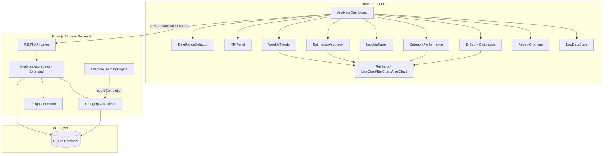
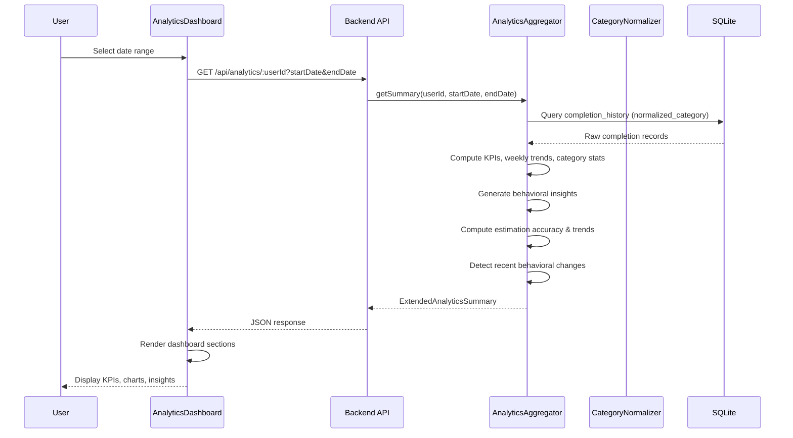
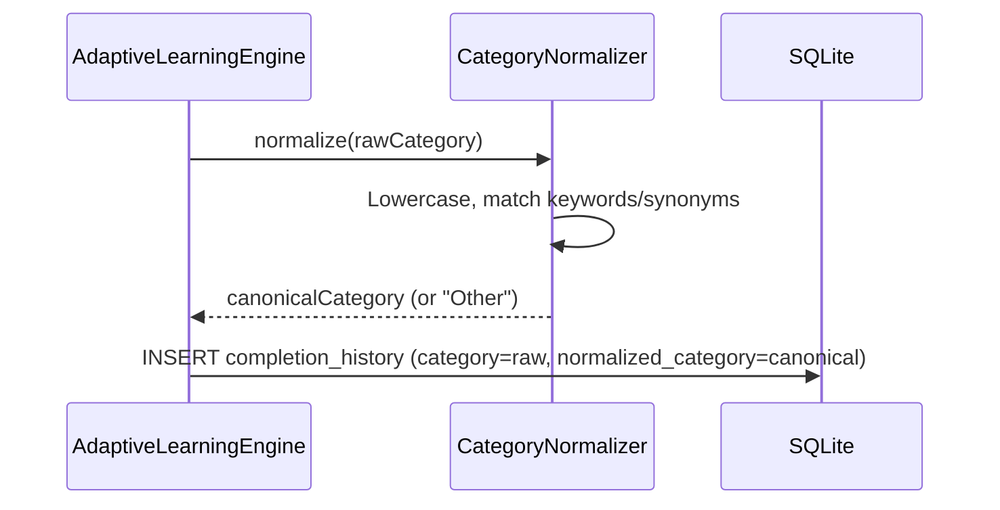

# Design Document: Analytics Dashboard Redesign

## Overview

The Analytics Dashboard Redesign transforms the existing flat analytics view into a rich behavioral insights dashboard. The current `AnalyticsDashboard.tsx` component fetches from `GET /api/analytics/:userId` and renders basic daily completion charts, time comparisons, difficulty breakdowns, and strength/improvement labels. The redesigned dashboard introduces overview KPIs, weekly behavior trends, normalized category performance, natural language behavioral insights, estimation accuracy tracking, difficulty/effort calibration, recent behavioral change detection, and thoughtful low-data states.

### Key Design Decisions

1. **Category normalization via keyword mapping**: Rather than using an LLM for category normalization, we use a deterministic keyword-based mapping utility (`CategoryNormalizer`). This keeps normalization fast, testable, and predictable. A static mapping table of keywords/synonyms to canonical categories lives in a utility module. Unmatched categories fall through to "Other".

2. **Schema migration with backfill**: We add a `normalized_category` column to `completion_history` and backfill existing records. The original `category` column is preserved. All analytics queries switch to grouping by `normalized_category`.

3. **Extended API response (backward compatible)**: The existing `GET /api/analytics/:userId` endpoint returns the current `AnalyticsSummary` shape plus new optional fields. Existing consumers that only read the current fields continue to work unchanged.

4. **Recharts for main visualizations**: All main analytics charts (line charts, bar charts, area charts) use [Recharts](https://recharts.org/) — a composable, responsive React charting library built on D3. Recharts provides built-in tooltips, legends, responsive containers, and accessible SVG output. Only micro-visuals (KPI trend arrows, mini progress rings, decorative accents) use hand-built inline SVG/CSS.

5. **Component decomposition**: The monolithic `AnalyticsDashboard.tsx` is broken into focused sub-components (KPIPanel, TrendSection, CategoryPerformance, InsightsPanel, etc.), each receiving data via props from the parent dashboard component. Chart sub-components use Recharts `ResponsiveContainer` for automatic resizing.

6. **Insight generation in the aggregator**: Pattern detection and natural language insight generation happen server-side in the `AnalyticsAggregator`, keeping the frontend a pure presentation layer.

7. **Linear regression for trend detection**: Estimation accuracy trend labels ("Improving", "Stable", "Declining") use a simple linear regression slope over weekly data points. This is a pure function that's straightforward to test.

## Architecture



### Data Flow



### Category Normalization Flow (on task completion)



## Components and Interfaces

### 1. CategoryNormalizer (New — `server/src/utils/category-normalizer.ts`)

A pure utility module that maps free-text category strings to canonical categories using keyword matching.

```typescript
/** Canonical category labels */
type CanonicalCategory =
  | "Writing"
  | "Development"
  | "Design"
  | "Research"
  | "Admin"
  | "Communication"
  | "Planning"
  | "Testing"
  | "Learning"
  | "Other";

/** A single mapping rule: keywords that map to a canonical category */
interface CategoryMapping {
  canonical: CanonicalCategory;
  keywords: string[]; // lowercase keywords and synonyms
}

/** The static mapping table */
const CATEGORY_MAPPINGS: CategoryMapping[] = [
  {
    canonical: "Writing",
    keywords: [
      "write",
      "writing",
      "blog",
      "article",
      "draft",
      "copy",
      "content",
      "documentation",
      "docs",
      "report",
    ],
  },
  {
    canonical: "Development",
    keywords: [
      "dev",
      "develop",
      "code",
      "coding",
      "programming",
      "implement",
      "build",
      "debug",
      "fix",
      "refactor",
      "deploy",
    ],
  },
  {
    canonical: "Design",
    keywords: [
      "design",
      "ui",
      "ux",
      "mockup",
      "wireframe",
      "prototype",
      "layout",
      "figma",
      "sketch",
    ],
  },
  {
    canonical: "Research",
    keywords: [
      "research",
      "investigate",
      "explore",
      "analyze",
      "analysis",
      "study",
      "review literature",
    ],
  },
  {
    canonical: "Admin",
    keywords: [
      "admin",
      "administrative",
      "organize",
      "file",
      "schedule",
      "booking",
      "invoice",
      "expense",
      "paperwork",
    ],
  },
  {
    canonical: "Communication",
    keywords: [
      "email",
      "meeting",
      "call",
      "chat",
      "discuss",
      "present",
      "presentation",
      "sync",
      "standup",
      "review",
    ],
  },
  {
    canonical: "Planning",
    keywords: [
      "plan",
      "planning",
      "roadmap",
      "strategy",
      "prioritize",
      "backlog",
      "sprint",
      "estimate",
    ],
  },
  {
    canonical: "Testing",
    keywords: [
      "test",
      "testing",
      "qa",
      "quality",
      "verify",
      "validation",
      "check",
    ],
  },
  {
    canonical: "Learning",
    keywords: [
      "learn",
      "learning",
      "study",
      "course",
      "tutorial",
      "training",
      "read",
      "reading",
    ],
  },
];

interface CategoryNormalizer {
  /** Map a raw category string to a canonical category */
  normalize(rawCategory: string): CanonicalCategory;

  /** Backfill all completion_history records that lack a normalized_category */
  backfill(db: Database): void;
}
```

**Normalization algorithm**:

1. Convert input to lowercase and trim whitespace
2. For each mapping rule, check if any keyword appears as a substring in the input
3. Return the first matching canonical category
4. If no match, return "Other"

The mapping table is ordered by specificity — more specific keywords (e.g., "debug") are checked before broader ones. Case-insensitive matching satisfies Requirement 1.4.

### 2. Extended AnalyticsAggregator (`server/src/services/analytics-aggregator.ts`)

The existing `AnalyticsAggregator` is extended with new methods. The `getSummary` method returns an `ExtendedAnalyticsSummary` that is a superset of the current `AnalyticsSummary`.

```typescript
/** Weekly aggregation bucket */
interface WeeklyTrendPoint {
  weekStart: string; // ISO date of Monday
  weekEnd: string; // ISO date of Sunday
  tasksCompleted: number;
  totalActualTime: number;
  avgActualTime: number;
  avgEstimatedTime: number;
  estimationAccuracy: number; // 0-1
  avgAbsolutePercentError: number; // 0-100
}

/** Per-category performance stats */
interface CategoryPerformanceStat {
  category: string; // canonical category
  avgEstimatedTime: number;
  avgActualTime: number;
  avgTimeOverrun: number; // actual - estimated, in minutes
  sampleSize: number;
}

/** A natural language behavioral insight */
interface BehavioralInsight {
  text: string;
  magnitude: number; // for ordering by significance
  type: "underestimation" | "speed-improvement" | "accuracy-improvement";
  category: string;
}

/** Per-difficulty-level calibration stats */
interface DifficultyCalibrationStat {
  difficultyLevel: number; // 1-5
  avgEstimatedTime: number;
  avgActualTime: number;
  avgTimeOverrun: number;
  taskCount: number;
}

/** A recent behavioral change for a category */
interface CategoryChange {
  category: string;
  percentageChange: number; // negative = faster, positive = slower
  recentAvgTime: number;
  previousAvgTime: number;
}

/** A task with a large time overrun */
interface OverrunTask {
  description: string;
  estimatedTime: number;
  actualTime: number;
  overrunMinutes: number;
}

/** Extended analytics summary — superset of AnalyticsSummary */
interface ExtendedAnalyticsSummary extends AnalyticsSummary {
  // New fields (all optional for backward compatibility)
  kpis?: {
    totalCompleted: number;
    completionRate: number; // percentage
    avgEstimatedTime: number;
    avgActualTime: number;
    estimationAccuracy: number; // percentage
    topImprovingCategory: string | null;
    mostDelayedCategory: string | null;
  };
  weeklyTrends?: WeeklyTrendPoint[];
  categoryPerformance?: {
    stats: CategoryPerformanceStat[];
    consistentlyFaster: string[]; // category names
    consistentlySlower: string[]; // category names
  };
  insights?: BehavioralInsight[];
  estimationAccuracyTrend?: {
    weeklyAccuracy: WeeklyTrendPoint[];
    trendLabel: "Improving" | "Stable" | "Declining";
  };
  difficultyCalibration?: DifficultyCalibrationStat[];
  recentChanges?: {
    fasterCategories: CategoryChange[];
    slowerCategories: CategoryChange[];
    largestOverruns: OverrunTask[];
    limitedDataCategories: string[];
  };
  dataStatus?: {
    totalCompletedTasks: number;
    weeksOfData: number;
    daysOfData: number;
  };
}
```

### 3. InsightGenerator (New — within `AnalyticsAggregator`)

The insight generator is a set of pure functions within the aggregator that detect patterns and produce natural language strings.

```typescript
interface InsightGenerator {
  /** Detect underestimation patterns (Req 5.2) */
  detectUnderestimation(stats: CategoryPerformanceStat[]): BehavioralInsight[];

  /** Detect speed improvement trends (Req 5.3) */
  detectSpeedImprovements(
    weeklyByCategory: Map<string, WeeklyTrendPoint[]>,
  ): BehavioralInsight[];

  /** Detect estimation accuracy improvements (Req 5.4) */
  detectAccuracyImprovements(
    weeklyByCategory: Map<string, WeeklyTrendPoint[]>,
  ): BehavioralInsight[];

  /** Combine and rank insights, return top 5 (Req 5.5) */
  generateInsights(
    stats: CategoryPerformanceStat[],
    weeklyByCategory: Map<string, WeeklyTrendPoint[]>,
  ): BehavioralInsight[];
}
```

### 4. Trend Analysis Utilities (New — `server/src/utils/trend-analysis.ts`)

Pure functions for computing linear regression slopes and trend labels.

```typescript
/** Compute the slope of a simple linear regression on (index, value) pairs */
function linearRegressionSlope(values: number[]): number;

/** Classify a slope as Improving, Stable, or Declining */
function classifyTrend(
  slope: number,
  threshold?: number,
): "Improving" | "Stable" | "Declining";

/** Compute per-task estimation accuracy: 1 - |actual - estimated| / estimated, clamped [0, 1] */
function estimationAccuracy(estimated: number, actual: number): number;
```

### 5. Frontend Components

#### AnalyticsDashboard (Refactored — `client/src/components/AnalyticsDashboard.tsx`)

The parent component fetches data and distributes it to child components.

```typescript
interface AnalyticsDashboardProps {
  userId: string;
}
// Fetches ExtendedAnalyticsSummary, renders sections in order:
// KPIPanel → WeeklyTrends → CategoryPerformance → InsightsPanel →
// EstimationAccuracy → DifficultyCalibration → RecentChanges
```

#### KPIPanel (`client/src/components/analytics/KPIPanel.tsx`)

```typescript
interface KPIPanelProps {
  kpis: ExtendedAnalyticsSummary["kpis"];
  insufficientData: boolean;
  totalCompleted: number;
}
// Renders 6 KPI cards in a horizontal row (stacked on mobile)
// Shows low-data state when totalCompleted < 5
```

#### TrendChart — Recharts LineChart wrapper (`client/src/components/analytics/TrendChart.tsx`)

A thin wrapper around Recharts `LineChart` with project-specific styling.

```typescript
interface TrendChartProps {
  data: { label: string; value: number; secondaryValue?: number }[];
  ariaLabel: string;
  height?: number; // default 250
  showSecondaryLine?: boolean;
  valueLabel?: string; // legend label for primary line, e.g. "Actual"
  secondaryLabel?: string; // legend label for secondary line, e.g. "Estimated"
  formatValue?: (value: number) => string; // tooltip/axis formatter
}
// Uses Recharts ResponsiveContainer + LineChart with:
// - XAxis with week labels
// - YAxis with auto-scaled domain
// - Tooltip with warm styling (white bg, warm border)
// - Legend when showSecondaryLine is true
// - Two Line elements (primary in accent orange, secondary in warm gray)
// - Dot markers on data points
// - Keyboard-accessible via Recharts built-in focus handling
```

#### BarChart — Recharts BarChart wrapper (`client/src/components/analytics/BarChart.tsx`)

A thin wrapper around Recharts `BarChart` for horizontal bar visualizations.

```typescript
interface BarChartProps {
  data: { label: string; value: number; highlight?: boolean }[];
  ariaLabel: string;
  maxValue?: number;
  layout?: "horizontal" | "vertical"; // default "horizontal"
}
// Uses Recharts ResponsiveContainer + BarChart with:
// - Bars colored in accent orange (highlighted) or warm gray (normal)
// - XAxis/YAxis with category labels
// - Tooltip with warm styling
// - Responsive sizing via ResponsiveContainer
```

#### WeeklyTrends (`client/src/components/analytics/WeeklyTrends.tsx`)

```typescript
interface WeeklyTrendsProps {
  weeklyTrends: WeeklyTrendPoint[];
  weeksOfData: number;
}
// Renders 3 TrendCharts (Recharts LineChart): tasks/week, time/week, actual vs estimated
// Shows low-data state when weeksOfData < 2
```

#### CategoryPerformance (`client/src/components/analytics/CategoryPerformance.tsx`)

```typescript
interface CategoryPerformanceProps {
  stats: CategoryPerformanceStat[];
  consistentlyFaster: string[];
  consistentlySlower: string[];
}
// Renders sortable table + faster/slower lists
// Shows insufficient-data indicator for categories with < 3 tasks
```

#### InsightsPanel (`client/src/components/analytics/InsightsPanel.tsx`)

```typescript
interface InsightsPanelProps {
  insights: BehavioralInsight[];
  totalCompleted: number;
}
// Renders up to 5 insight cards
// Shows low-data state when totalCompleted < 10
```

#### EstimationAccuracy (`client/src/components/analytics/EstimationAccuracy.tsx`)

```typescript
interface EstimationAccuracyProps {
  weeklyAccuracy: WeeklyTrendPoint[];
  trendLabel: "Improving" | "Stable" | "Declining";
  weeksOfData: number;
}
// Renders 2 TrendCharts (Recharts LineChart) for accuracy % and error % + trend label badge
// Shows low-data state when weeksOfData < 2
```

#### DifficultyCalibration (`client/src/components/analytics/DifficultyCalibration.tsx`)

```typescript
interface DifficultyCalibrationProps {
  calibration: DifficultyCalibrationStat[];
}
// Renders table with highlight for >20% overestimation
// Shows insufficient-data indicator for levels with < 3 tasks
// Shows correlation indicator
```

#### RecentChanges (`client/src/components/analytics/RecentChanges.tsx`)

```typescript
interface RecentChangesProps {
  fasterCategories: CategoryChange[];
  slowerCategories: CategoryChange[];
  largestOverruns: OverrunTask[];
  limitedDataCategories: string[];
  daysOfData: number;
}
// Renders faster/slower lists, top overruns, limited data categories
// Shows low-data state when daysOfData < 14
```

#### LowDataState (`client/src/components/analytics/LowDataState.tsx`)

```typescript
interface LowDataStateProps {
  current: number;
  required: number;
  unit: string; // "tasks", "weeks", "days"
  sectionName: string;
}
// Renders a warm editorial-styled message with progress indicator
// Uses cream background and orange accent
```

### REST API Changes

The existing endpoint is extended, not replaced:

| Method | Path                                       | Changes                                                                      |
| ------ | ------------------------------------------ | ---------------------------------------------------------------------------- |
| GET    | `/api/analytics/:userId?startDate&endDate` | Response shape extended with new optional fields. Existing fields preserved. |

No new endpoints are needed. The aggregator computes all new data server-side.

## Data Models

### Schema Migration

Add `normalized_category` column to `completion_history`:

```sql
ALTER TABLE completion_history
  ADD COLUMN normalized_category TEXT DEFAULT NULL;
```

The migration runs as part of the existing `runMigrations` function in `server/src/db/schema.ts`. After adding the column, the backfill operation populates it for all existing records.

### Updated completion_history Schema

```sql
CREATE TABLE IF NOT EXISTS completion_history (
  id TEXT PRIMARY KEY,
  user_id TEXT NOT NULL REFERENCES users(id),
  task_description TEXT NOT NULL,
  category TEXT,                    -- original raw category (preserved)
  normalized_category TEXT,         -- canonical category from CategoryNormalizer
  estimated_time INTEGER NOT NULL,
  actual_time INTEGER NOT NULL,
  difficulty_level INTEGER NOT NULL,
  completed_at TIMESTAMP DEFAULT CURRENT_TIMESTAMP
);
```

### Key Data Invariants

- `normalized_category` is always one of the defined `CanonicalCategory` values or NULL (for records not yet backfilled)
- The original `category` column is never modified by normalization
- `estimationAccuracy` per task is clamped to [0, 1]: `max(0, min(1, 1 - abs(actual - estimated) / estimated))`
- `estimationAccuracy` is undefined when `estimated_time` is 0; such records are excluded from accuracy calculations
- Weekly trend points cover exactly 8 weeks of data (or fewer if insufficient history)
- Insight generation requires at least 10 completed tasks total and at least 5 per category for underestimation insights
- Category performance "consistently faster/slower" requires at least 3 tasks and a 10% threshold
- Difficulty calibration highlights require a 20% overestimation threshold
