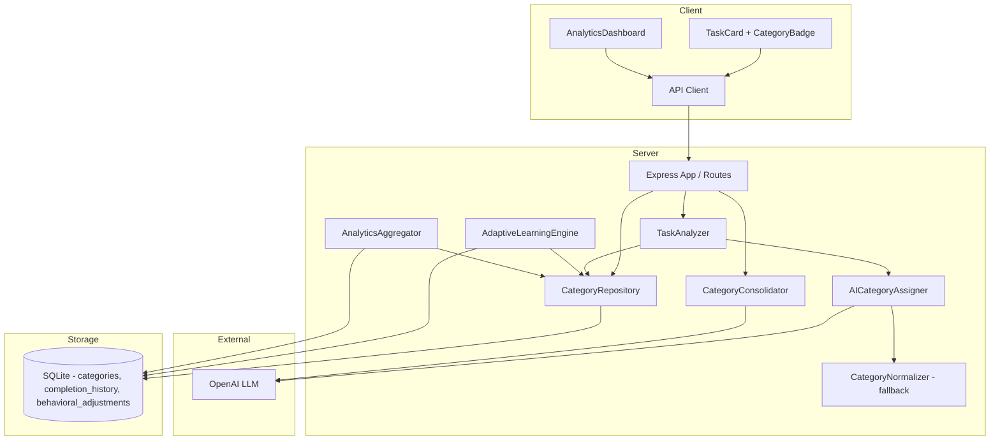
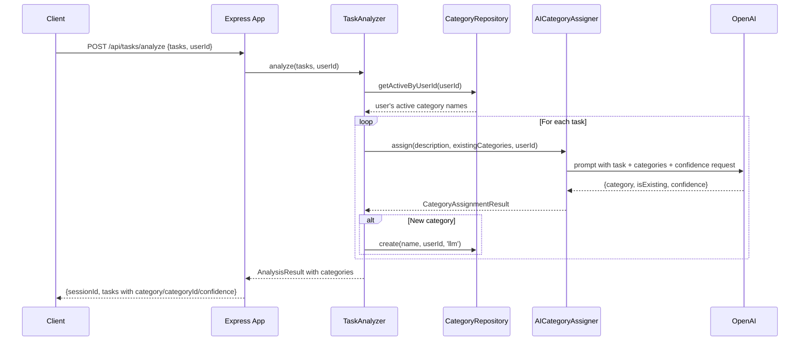
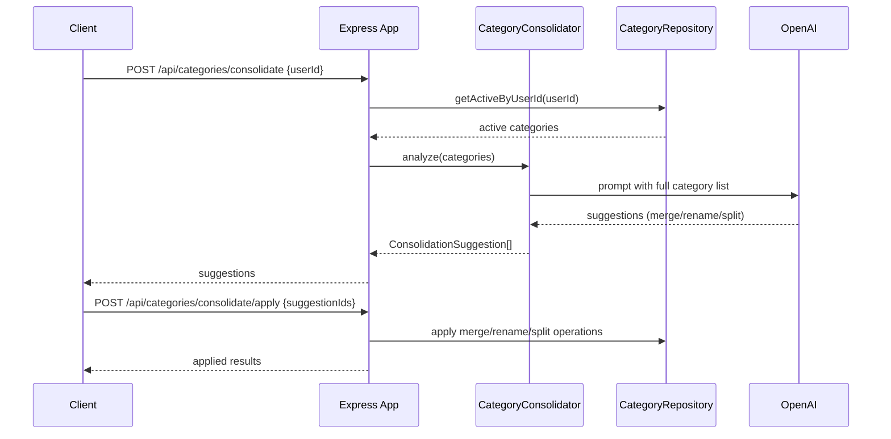

# Design Document: Dynamic AI Categories

## Overview

This design transforms the category system from a static, predefined taxonomy (10 seeded canonical categories) into a fully dynamic, AI-driven, per-user category system. Each user starts with zero categories. Categories emerge organically from AI analysis of real tasks, are scoped per-user, and include lifecycle tracking (active/merged/archived). A new consolidation service uses AI to suggest taxonomy cleanups (merges, renames, splits). Category badges appear on task cards in the UI with deterministic color mapping.

The design evolves existing infrastructure — `CategoryRepository`, `AICategoryAssigner`, `TaskAnalyzer`, `AdaptiveLearningEngine`, `AnalyticsAggregator` — rather than replacing it. The keyword normalizer (`category-normalizer.ts`) is retained as a last-resort fallback only.

### Key Design Decisions

1. **Soft-delete for merges**: Merged categories retain their row with `status = 'merged'` and a `merged_into_category_id` pointer, preserving audit history and enabling analytics rollup.
2. **Per-user uniqueness via composite constraint**: Category name uniqueness is scoped to `(user_id, name)` with `COLLATE NOCASE`, replacing the current global uniqueness constraint.
3. **Confidence-aware assignment**: The LLM returns a confidence score alongside category assignments, enabling quality tracking and re-evaluation of low-confidence assignments.
4. **Deterministic color mapping**: A hash-based function maps category names to a fixed palette of muted colors, ensuring visual consistency without storing color preferences.
5. **Non-destructive migration**: All schema changes use `ALTER TABLE ADD COLUMN` with defaults, preserving existing data. Ownership is inferred from completion history during backfill.

## Architecture

### System Architecture



### Request Flow: Task Analysis with Category Assignment



### Request Flow: Category Consolidation



## Components and Interfaces

### Server Components

#### CategoryRepository (evolved)

The existing `CategoryRepository` is extended to support per-user ownership, lifecycle status, and merge tracking.

```typescript
// server/src/db/category-repository.ts

export interface CategoryEntity {
  id: number;
  name: string;
  userId: string;
  status: "active" | "merged" | "archived";
  createdBy: "llm" | "user" | "system" | "fallback";
  mergedIntoCategoryId: number | null;
  createdAt: string;
  updatedAt: string;
}

export class CategoryRepository {
  constructor(db: Database.Database) {}

  /** Get all active categories for a user, ordered by name. */
  getActiveByUserId(userId: string): CategoryEntity[];

  /** Get all active category names for a user as a string array. */
  getActiveNamesByUserId(userId: string): string[];

  /** Find a category by ID. */
  findById(id: number): CategoryEntity | null;

  /** Find a category by name for a specific user (case-insensitive). */
  findByNameAndUserId(name: string, userId: string): CategoryEntity | null;

  /**
   * Create a new category for a user. Returns existing if name already
   * exists for that user (case-insensitive).
   */
  create(
    name: string,
    userId: string,
    createdBy: CategoryEntity["createdBy"],
  ): CategoryEntity;

  /** Rename a category. Updates updated_at. */
  rename(id: number, newName: string): CategoryEntity;

  /** Set a category's status to 'archived'. */
  archive(id: number): void;

  /**
   * Merge source into target: set source status to 'merged',
   * populate merged_into_category_id, update all references.
   */
  merge(sourceId: number, targetId: number): void;

  /** Count active categories for a user. */
  countActiveByUserId(userId: string): number;

  /** Follow merged_into_category_id chain to resolve the final active category. */
  resolveCategory(categoryId: number): CategoryEntity;

  // Legacy methods retained for backward compatibility during migration
  getAll(): CategoryEntity[];
  getAllNames(): string[];
}
```

#### AICategoryAssigner (evolved)

Extended to return confidence scores, enforce naming rules, and support the >20 category threshold.

```typescript
// server/src/services/ai-category-assigner.ts

export interface CategoryAssignmentResult {
  /** The raw string returned by the LLM, or null if fallback was used */
  rawLLMCategory: string | null;
  /** The resolved category name (existing or newly created) */
  finalCategory: string;
  /** Whether the LLM proposed a new category (not in the existing list) */
  isNew: boolean;
  /** LLM confidence score 0.0-1.0, or 0.0 for fallback */
  confidence: number;
  /** How the category was assigned */
  source: "llm" | "fallback";
  /** When confidence < 0.5 and isNew, the closest existing category */
  closestExisting: string | null;
  /** Whether the assignment is flagged as low confidence */
  lowConfidence: boolean;
}

export class AICategoryAssigner {
  constructor(client?: OpenAI, model?: string) {}

  /**
   * Assign a category to a task description.
   * Now accepts userId context for the >20 category threshold.
   */
  async assign(
    description: string,
    existingCategories: string[],
    activeCategoryCount?: number,
  ): Promise<CategoryAssignmentResult>;
}
```

The LLM prompt is updated to:

- Request a JSON response with `{ category, isExisting, confidence }` fields
- Include the full list of active categories
- Add the >20 category warning when `activeCategoryCount > 20`
- Instruct the LLM to validate new names are not synonyms of existing ones
- Enforce ≤3 word, title-case naming rules
- Request confidence score 0.0-1.0

When a proposed new category name exceeds 3 words, the system truncates to the first 3 words. If the truncated name matches an existing category, it uses that match. Otherwise it falls back to the closest existing category or the keyword normalizer.

#### CategoryConsolidator (new)

```typescript
// server/src/services/category-consolidator.ts

export type SuggestionAction = "merge" | "rename" | "split";

export interface ConsolidationSuggestion {
  id: string; // UUID for tracking
  action: SuggestionAction;
  // For merge:
  sourceCategoryId?: number;
  sourceCategoryName?: string;
  targetCategoryId?: number;
  targetCategoryName?: string;
  // For rename:
  categoryId?: number;
  currentName?: string;
  proposedName?: string;
  // For split:
  categoryId?: number;
  currentName?: string;
  proposedNames?: string[];
  // Common:
  reason: string;
}

export class CategoryConsolidator {
  constructor(client?: OpenAI, model?: string) {}

  /**
   * Analyze a user's category list and produce consolidation suggestions.
   * Does NOT apply changes — returns suggestions for review.
   */
  async analyze(
    categories: CategoryEntity[],
  ): Promise<ConsolidationSuggestion[]>;
}
```

#### TaskAnalyzer (evolved)

Updated to pass `userId` through the category assignment flow and store confidence metadata.

```typescript
// Changes to server/src/services/task-analyzer.ts

export class TaskAnalyzer {
  // Updated analyze method signature (userId already exists)
  async analyze(tasks: ParsedTask[], userId: string): Promise<AnalysisResult> {
    // ...existing metric analysis...

    // Category assignment now uses per-user categories
    if (this.categoryAssigner && this.categoryRepo) {
      const activeCategories = this.categoryRepo.getActiveNamesByUserId(userId);
      const activeCategoryCount = this.categoryRepo.countActiveByUserId(userId);

      for (const analyzedTask of analyzedTasks) {
        const result = await this.categoryAssigner.assign(
          analyzedTask.description,
          activeCategories,
          activeCategoryCount,
        );

        // Create or find category for this user
        const categoryEntity = this.categoryRepo.create(
          result.finalCategory,
          userId,
          result.source === "llm" ? "llm" : "fallback",
        );

        analyzedTask.category = categoryEntity.name;
        analyzedTask.categoryId = categoryEntity.id;
        analyzedTask.categoryConfidence = result.confidence;
      }
    }
  }
}
```

#### AdaptiveLearningEngine (evolved)

Updated to resolve categories via `CategoryRepository` using per-user scoping and `category_id`.

```typescript
// Changes to server/src/services/adaptive-learning-engine.ts

export class AdaptiveLearningEngine {
  // recordCompletion now stores category metadata
  recordCompletion(record: CompletionRecord): void {
    // Resolve category_id from the user's categories
    // Store raw_llm_category, category_confidence, category_source
    // Group behavioral_adjustments by category_id
  }

  // getBehavioralModel groups by category_id, joins to categories table
  getBehavioralModel(userId: string): BehavioralModel {
    // JOIN categories ON category_id, filter by user's categories
  }
}
```

#### AnalyticsAggregator (evolved)

Updated to follow merge pointers and group by `category_id`.

```typescript
// Changes to server/src/services/analytics-aggregator.ts

export class AnalyticsAggregator {
  // All category queries now:
  // 1. JOIN categories ON category_id
  // 2. Follow merged_into_category_id for merged categories
  // 3. Filter to active categories for display
  // 4. Use current category name from categories table
}
```

### API Endpoints

#### Updated Endpoints

| Method  | Path                          | Changes                                                                                        |
| ------- | ----------------------------- | ---------------------------------------------------------------------------------------------- |
| `GET`   | `/api/categories`             | Add `userId` query param; return only active categories for that user                          |
| `POST`  | `/api/categories/merge`       | Soft-delete source (set status='merged', populate merged_into_category_id) instead of deleting |
| `PATCH` | `/api/categories/:categoryId` | Update `updated_at` timestamp on rename                                                        |
| `POST`  | `/api/tasks/analyze`          | Response includes `categoryConfidence` per task                                                |

#### New Endpoints

| Method  | Path                                  | Description                                        |
| ------- | ------------------------------------- | -------------------------------------------------- |
| `POST`  | `/api/categories`                     | Create a category manually (`created_by = 'user'`) |
| `PATCH` | `/api/categories/:categoryId/archive` | Set category status to 'archived'                  |
| `POST`  | `/api/categories/consolidate`         | Trigger consolidation analysis, return suggestions |
| `POST`  | `/api/categories/consolidate/apply`   | Apply approved consolidation suggestions           |

#### New Endpoint Details

**POST /api/categories**

```typescript
// Request
{ name: string; userId: string }
// Response 201
{ id: number; name: string; userId: string; status: 'active'; createdBy: 'user'; ... }
// Error 400: missing/invalid params
// Error 409: category name already exists for user
```

**PATCH /api/categories/:categoryId/archive**

```typescript
// Response 200
{ id: number; name: string; status: 'archived'; ... }
// Error 404: category not found
```

**POST /api/categories/consolidate**

```typescript
// Request
{ userId: string }
// Response 200
{ suggestions: ConsolidationSuggestion[] }
```

**POST /api/categories/consolidate/apply**

```typescript
// Request
{ userId: string; suggestionIds: string[]; suggestions: ConsolidationSuggestion[] }
// Response 200
{ applied: string[]; errors: { suggestionId: string; error: string }[] }
```

### Client Components

#### CategoryBadge (new)

```typescript
// client/src/components/CategoryBadge.tsx

export interface CategoryBadgeProps {
  categoryName: string;
}

/**
 * Renders a small rounded pill with a soft background tint derived
 * deterministically from the category name. Text color is chosen
 * for WCAG AA contrast against the background.
 */
export default function CategoryBadge({
  categoryName,
}: CategoryBadgeProps): JSX.Element;
```

#### categoryColor utility (new)

```typescript
// client/src/utils/category-color.ts

/** Predefined palette of 12 soft, muted background colors */
const CATEGORY_PALETTE: { bg: string; text: string }[] = [
  { bg: "#DBEAFE", text: "#1E40AF" }, // blue
  { bg: "#D1FAE5", text: "#065F46" }, // green
  { bg: "#FEF3C7", text: "#92400E" }, // amber
  { bg: "#FCE7F3", text: "#9D174D" }, // pink
  { bg: "#E0E7FF", text: "#3730A3" }, // indigo
  { bg: "#CCFBF1", text: "#134E4A" }, // teal
  { bg: "#FEE2E2", text: "#991B1B" }, // red
  { bg: "#F3E8FF", text: "#6B21A8" }, // purple
  { bg: "#FEF9C3", text: "#854D0E" }, // yellow
  { bg: "#E2E8F0", text: "#334155" }, // slate
  { bg: "#FFE4E6", text: "#9F1239" }, // rose
  { bg: "#CFFAFE", text: "#155E75" }, // cyan
];

/**
 * Deterministic hash-based color mapping.
 * Same category name always returns the same palette entry.
 */
export function getCategoryColor(name: string): { bg: string; text: string };

/**
 * Simple string hash function (djb2 variant).
 */
function hashString(str: string): number;
```

All palette entries meet WCAG AA contrast ratio (≥4.5:1 for normal text) between the text and background colors.

#### TaskCard (evolved)

The `TaskCard` component adds a `CategoryBadge` in the metrics row, between the priority badge and effort indicator.

```typescript
// Changes to client/src/components/TaskCard.tsx

import CategoryBadge from "./CategoryBadge";

// In the metrics row, add:
{task.category && <CategoryBadge categoryName={task.category} />}
```

#### Client Types (evolved)

```typescript
// Changes to client/src/types/index.ts

export interface AnalyzedTask extends ParsedTask {
  metrics: TaskMetrics;
  category?: string;
  categoryId?: number;
  /** LLM confidence score for the category assignment */
  categoryConfidence?: number;
}

// Remove or deprecate CanonicalCategory type
// (keep temporarily for backward compatibility, mark as deprecated)

export interface CategoryEntity {
  id: number;
  name: string;
  userId: string;
  status: "active" | "merged" | "archived";
  createdBy: "llm" | "user" | "system" | "fallback";
  mergedIntoCategoryId: number | null;
  createdAt: string;
  updatedAt: string;
}
```

#### API Client (evolved)

```typescript
// New functions in client/src/api/client.ts

/** GET /api/categories?userId=... */
export async function getCategories(userId: string): Promise<CategoryEntity[]>;

/** POST /api/categories */
export async function createCategory(
  name: string,
  userId: string,
): Promise<CategoryEntity>;

/** PATCH /api/categories/:id/archive */
export async function archiveCategory(
  categoryId: number,
): Promise<CategoryEntity>;

/** POST /api/categories/consolidate */
export async function consolidateCategories(
  userId: string,
): Promise<{ suggestions: ConsolidationSuggestion[] }>;

/** POST /api/categories/consolidate/apply */
export async function applyConsolidation(
  userId: string,
  suggestionIds: string[],
  suggestions: ConsolidationSuggestion[],
): Promise<{
  applied: string[];
  errors: { suggestionId: string; error: string }[];
}>;
```

## Data Models

### Database Schema Changes

#### categories table (evolved)

```sql
-- New schema (replaces current)
CREATE TABLE IF NOT EXISTS categories (
  id INTEGER PRIMARY KEY AUTOINCREMENT,
  name TEXT NOT NULL COLLATE NOCASE,
  user_id TEXT NOT NULL REFERENCES users(id),
  status TEXT NOT NULL DEFAULT 'active' CHECK (status IN ('active', 'merged', 'archived')),
  created_by TEXT NOT NULL DEFAULT 'system' CHECK (created_by IN ('llm', 'user', 'system', 'fallback')),
  merged_into_category_id INTEGER REFERENCES categories(id) DEFAULT NULL,
  created_at TIMESTAMP DEFAULT CURRENT_TIMESTAMP,
  updated_at TIMESTAMP DEFAULT CURRENT_TIMESTAMP,
  UNIQUE(user_id, name)
);
```

Key changes:

- Added `user_id` column (NOT NULL, references users)
- Added `status` column with CHECK constraint
- Added `created_by` column with CHECK constraint
- Added `merged_into_category_id` self-referencing foreign key
- Added `updated_at` timestamp
- Changed UNIQUE constraint from `(name)` to `(user_id, name)`

#### completion_history table (evolved)

```sql
-- New columns added via ALTER TABLE
ALTER TABLE completion_history ADD COLUMN raw_llm_category TEXT DEFAULT NULL;
ALTER TABLE completion_history ADD COLUMN category_confidence REAL DEFAULT NULL;
ALTER TABLE completion_history ADD COLUMN category_source TEXT DEFAULT NULL
  CHECK (category_source IN ('llm', 'fallback', 'user'));
```

#### Migration Strategy

The migration is implemented as an idempotent function in `schema.ts`:

```typescript
export function runMigrations(db: Database.Database): void {
  // 1. Add new columns to categories table (if not exist)
  //    - user_id, status, created_by, merged_into_category_id, updated_at
  // 2. Backfill user_id on existing categories:
  //    - For each category, find the user with the most completion_history
  //      rows referencing that category_id
  //    - Assign that user as the owner
  //    - If no completions reference the category, assign to the first user
  //      in the users table (or a default 'system' user)
  // 3. Set status='active' and created_by='system' for all existing rows
  // 4. Drop old UNIQUE(name) constraint and add UNIQUE(user_id, name)
  //    (SQLite requires table recreation for constraint changes)
  // 5. Add new columns to completion_history:
  //    - raw_llm_category, category_confidence, category_source
  // 6. Remove canonical category seeding for new databases
  //    (existing categories are preserved)
  // 7. All operations are idempotent (check column existence before ALTER)
}
```

### Entity Relationship Diagram

```mermaid
erDiagram
    users ||--o{ categories : "owns"
    users ||--o{ completion_history : "has"
    users ||--o{ behavioral_adjustments : "has"
    categories ||--o{ completion_history : "referenced by"
    categories ||--o{ behavioral_adjustments : "referenced by"
    categories ||--o| categories : "merged into"

    users {
        TEXT id PK
        TIMESTAMP created_at
    }

    categories {
        INTEGER id PK
        TEXT name
        TEXT user_id FK
        TEXT status
        TEXT created_by
        INTEGER merged_into_category_id FK
        TIMESTAMP created_at
        TIMESTAMP updated_at
    }

    completion_history {
        TEXT id PK
        TEXT user_id FK
        TEXT task_description
        TEXT category
        TEXT normalized_category
        INTEGER category_id FK
        TEXT raw_llm_category
        REAL category_confidence
        TEXT category_source
        INTEGER estimated_time
        INTEGER actual_time
        INTEGER difficulty_level
        TIMESTAMP completed_at
    }

    behavioral_adjustments {
        TEXT user_id PK_FK
        TEXT category PK
        INTEGER category_id FK
        REAL time_multiplier
        REAL difficulty_adjustment
        INTEGER sample_size
        TIMESTAMP updated_at
    }
```

## Correctness Properties

_A property is a characteristic or behavior that should hold true across all valid executions of a system — essentially, a formal statement about what the system should do. Properties serve as the bridge between human-readable specifications and machine-verifiable correctness guarantees._

### Property 1: Per-User Category Isolation

_For any_ two distinct users A and B, each with their own set of categories, calling `getActiveByUserId(A)` SHALL return only categories where `user_id = A`, and none of user B's categories SHALL appear in the result.

**Validates: Requirements 2.2, 16.1**

### Property 2: Category Creation Metadata Correctness

_For any_ category created via `CategoryRepository.create(name, userId, createdBy)`, the resulting `CategoryEntity` SHALL have `userId` equal to the provided user ID, `createdBy` equal to the provided source, `status` equal to `'active'`, and `name` equal to the provided name (modulo case normalization).

**Validates: Requirements 2.3, 16.3**

### Property 3: Per-User Case-Insensitive Name Uniqueness

_For any_ user and any two category names that differ only in letter casing, creating both for the same user SHALL result in a single category row (the second create returns the existing one). However, _for any_ two distinct users, creating the same category name for each SHALL result in two separate category rows.

**Validates: Requirements 2.4**

### Property 4: Merge Preserves Source Row and Updates All References

_For any_ two active categories (source, target) belonging to the same user, after merging source into target: (a) the source row SHALL still exist with `status = 'merged'` and `merged_into_category_id = target.id`, (b) all `completion_history` rows that previously referenced `source.id` SHALL now reference `target.id`, (c) all `behavioral_adjustments` rows for the source SHALL be merged into the target using weighted averages, and (d) the total count of completion_history rows SHALL remain unchanged.

**Validates: Requirements 3.5, 8.3, 14.2**

### Property 5: Category Name Validation — Three Word Limit

_For any_ string proposed as a category name that contains more than three whitespace-separated words, the system SHALL either truncate it to three words or reject it and fall back to an existing category or the normalizer. The final resolved category name SHALL never contain more than three words.

**Validates: Requirements 5.4**

### Property 6: Conservative Category Creation Threshold

_For any_ user with more than 20 active categories, the prompt sent to the LLM by the `AICategoryAssigner` SHALL contain an additional instruction emphasizing that new categories should only be created in exceptional cases. _For any_ user with 20 or fewer active categories, this additional instruction SHALL NOT be present.

**Validates: Requirements 6.3**

### Property 7: Deterministic Color Mapping

_For any_ category name string, calling `getCategoryColor(name)` multiple times SHALL always return the same `{ bg, text }` pair, and the returned pair SHALL be a member of the predefined `CATEGORY_PALETTE` array (which has at least 10 entries).

**Validates: Requirements 11.3, 12.1, 12.2**

### Property 8: WCAG AA Contrast for Category Palette

_For every_ entry in the `CATEGORY_PALETTE`, the contrast ratio between the `text` color and the `bg` color SHALL be at least 4.5:1 (WCAG AA for normal text).

**Validates: Requirements 11.6**

### Property 9: Fallback Produces Correct Metadata

_For any_ task description where the LLM fails after retry, the `CategoryAssignmentResult` SHALL have `rawLLMCategory = null`, `source = 'fallback'`, `confidence = 0.0`, and `isNew = false`.

**Validates: Requirements 10.2**

### Property 10: "Other" Fallback Triggers Low Confidence Flag

_For any_ task description where the fallback normalizer produces "Other" as the category, the `CategoryAssignmentResult` SHALL have `lowConfidence = true`.

**Validates: Requirements 10.4**

### Property 11: Migration Backfill Assigns Correct User Ownership

_For any_ set of existing categories with completion_history references from multiple users, after running the migration backfill, each category's `user_id` SHALL be set to the user who has the most completion_history rows referencing that category.

**Validates: Requirements 15.2**

### Property 12: Migration Idempotency

_For any_ initial database state (empty or with existing data), running `runMigrations` twice SHALL produce the same database state as running it once. Specifically, the row counts, column values, and schema SHALL be identical after the first and second runs.

**Validates: Requirements 15.5**

### Property 13: Name Resolution After Rename

_For any_ category that has been renamed, both the `AnalyticsAggregator` and the `AdaptiveLearningEngine` SHALL use the new name when computing category performance statistics and behavioral adjustments, respectively. No results SHALL reference the old name.

**Validates: Requirements 13.1, 13.4**

### Property 14: Analytics Follows Merge Pointers

_For any_ category with `status = 'merged'`, the `AnalyticsAggregator` SHALL follow the `merged_into_category_id` pointer and roll up all historical completion data under the target category. The merged category SHALL NOT appear as a separate entry in analytics results.

**Validates: Requirements 13.2**

### Property 15: API Error Responses

_For any_ request to a category management endpoint with missing or invalid required parameters, the system SHALL return HTTP 400 with a descriptive error message. _For any_ request referencing a non-existent category ID, the system SHALL return HTTP 404.

**Validates: Requirements 14.6, 14.7**

### Property 16: Rename Preserves Reference Counts

_For any_ category with N completion_history references and M behavioral_adjustment references, after renaming the category, the count of completion_history rows referencing that category_id SHALL still be N, and the count of behavioral_adjustment rows SHALL still be M.

**Validates: Requirements 8.4**

### Property 17: Consolidation Suggestion Structural Validity

_For any_ `ConsolidationSuggestion` returned by the `CategoryConsolidator`: if `action = 'merge'`, then `sourceCategoryId`, `sourceCategoryName`, `targetCategoryId`, and `targetCategoryName` SHALL all be defined; if `action = 'rename'`, then `categoryId`, `currentName`, and `proposedName` SHALL all be defined; if `action = 'split'`, then `categoryId`, `currentName`, and `proposedNames` (with length ≥ 2) SHALL all be defined.

**Validates: Requirements 7.2, 7.3, 7.4, 7.5**

## Error Handling

### LLM Failures

| Scenario                                       | Behavior                                                                              |
| ---------------------------------------------- | ------------------------------------------------------------------------------------- |
| LLM returns invalid JSON (category assignment) | Retry once with stricter prompt. If retry fails, fall back to keyword normalizer.     |
| LLM returns invalid JSON (consolidation)       | Retry once with stricter prompt. If retry fails, return empty suggestions array.      |
| LLM timeout or network error                   | Same retry + fallback behavior as invalid JSON.                                       |
| LLM returns confidence < 0.5 for new category  | Include `closestExisting` in result for logging/flagging.                             |
| LLM proposes >3 word category name             | Truncate to 3 words. If truncated name matches existing, use it. Otherwise fall back. |

### Database Errors

| Scenario                                       | Behavior                                                         |
| ---------------------------------------------- | ---------------------------------------------------------------- |
| UNIQUE constraint violation on category create | Return existing category (upsert semantics).                     |
| Foreign key violation on merge                 | Return 400 with descriptive error.                               |
| Category not found (any operation)             | Return 404.                                                      |
| Migration failure                              | Transaction rollback. Log error. Re-runnable due to idempotency. |

### API Validation Errors

| Scenario                                                  | HTTP Status | Response                                                                   |
| --------------------------------------------------------- | ----------- | -------------------------------------------------------------------------- |
| Missing `userId` on category endpoints                    | 400         | `{ error: "Missing required field: userId" }`                              |
| Missing `name` on create/rename                           | 400         | `{ error: "Missing required field: name" }`                                |
| Invalid `sourceCategoryId` or `targetCategoryId` on merge | 400         | `{ error: "Missing required fields: sourceCategoryId, targetCategoryId" }` |
| Merge category with itself                                | 400         | `{ error: "Cannot merge a category with itself" }`                         |
| Non-existent category ID                                  | 404         | `{ error: "Category not found" }`                                          |
| Duplicate category name for user                          | 409         | `{ error: "A category with this name already exists" }`                    |

### Fallback Chain

```
Task Description
  → AICategoryAssigner (LLM attempt 1)
    → AICategoryAssigner (LLM attempt 2, stricter prompt)
      → CategoryNormalizer (keyword matching)
        → "Other" (last resort, flagged as lowConfidence)
```

## Testing Strategy

### Dual Testing Approach

This feature uses both unit tests and property-based tests for comprehensive coverage:

- **Property-based tests** (using `fast-check`): Verify universal properties across many generated inputs. Each property test runs a minimum of 100 iterations and references a specific correctness property from this design document.
- **Unit tests** (using `vitest`): Verify specific examples, edge cases, integration points, and error conditions.

### Property-Based Testing Configuration

- **Library**: `fast-check` (already in project dependencies)
- **Framework**: `vitest` (already configured)
- **Minimum iterations**: 100 per property test
- **Tag format**: `Feature: dynamic-ai-categories, Property {number}: {property_text}`

### Property Test Plan

| Property                           | Test File                                | What's Generated                                                                | What's Verified                                                                                                  |
| ---------------------------------- | ---------------------------------------- | ------------------------------------------------------------------------------- | ---------------------------------------------------------------------------------------------------------------- |
| 1: Per-User Category Isolation     | `category-repository.property.test.ts`   | Random user IDs, random category names per user                                 | `getActiveByUserId` returns only that user's categories                                                          |
| 2: Category Creation Metadata      | `category-repository.property.test.ts`   | Random names, user IDs, createdBy values                                        | Created entity has correct metadata fields                                                                       |
| 3: Per-User Name Uniqueness        | `category-repository.property.test.ts`   | Random user pairs, random category names with case variations                   | Same-user duplicates return existing; cross-user duplicates create separate rows                                 |
| 4: Merge Preserves and Updates     | `category-merge.property.test.ts`        | Random categories with random completion_history and behavioral_adjustment rows | Source row preserved with merged status; all references updated; weighted averages correct; row counts unchanged |
| 5: Name Validation (3 words)       | `ai-category-assigner.property.test.ts`  | Random strings of 1-10 words                                                    | Names >3 words are truncated or rejected                                                                         |
| 6: >20 Category Threshold          | `ai-category-assigner.property.test.ts`  | Random category counts (0-50)                                                   | Prompt contains extra instruction iff count > 20                                                                 |
| 7: Deterministic Color Mapping     | `category-color.property.test.ts`        | Random category name strings                                                    | Same input → same output; output ∈ palette                                                                       |
| 8: WCAG AA Contrast                | `category-color.property.test.ts`        | Each palette entry (exhaustive)                                                 | Contrast ratio ≥ 4.5:1                                                                                           |
| 9: Fallback Metadata               | `ai-category-assigner.property.test.ts`  | Random task descriptions (with mocked LLM failure)                              | Result has null rawLLMCategory, source='fallback', confidence=0.0                                                |
| 10: "Other" Low Confidence         | `ai-category-assigner.property.test.ts`  | Random descriptions that normalize to "Other"                                   | lowConfidence = true                                                                                             |
| 11: Migration Backfill Ownership   | `migration-backfill.property.test.ts`    | Random categories with random completion histories from multiple users          | user_id assigned to user with most completions                                                                   |
| 12: Migration Idempotency          | `migration-idempotency.property.test.ts` | Random initial DB states                                                        | State after 1 run === state after 2 runs                                                                         |
| 13: Name Resolution After Rename   | `analytics-rename.property.test.ts`      | Random categories with completions, random new names                            | Analytics and learning engine use new name                                                                       |
| 14: Analytics Merge Rollup         | `analytics-merge.property.test.ts`       | Random categories with completions, merge operations                            | Merged category data appears under target                                                                        |
| 15: API Error Responses            | `category-api.property.test.ts`          | Random invalid payloads, random non-existent IDs                                | 400 for invalid params, 404 for missing IDs                                                                      |
| 16: Rename Preserves References    | `category-rename.property.test.ts`       | Random categories with N references, random new names                           | Reference counts unchanged after rename                                                                          |
| 17: Suggestion Structural Validity | `category-consolidator.property.test.ts` | Random LLM responses parsed as suggestions                                      | Each suggestion type has all required fields                                                                     |

### Unit Test Plan

| Area                    | Test File                       | Key Scenarios                                                                                       |
| ----------------------- | ------------------------------- | --------------------------------------------------------------------------------------------------- |
| CategoryRepository CRUD | `category-repository.test.ts`   | Create, find, rename, archive, merge, getActiveByUserId                                             |
| AICategoryAssigner      | `ai-category-assigner.test.ts`  | Successful assignment, retry on parse failure, fallback to normalizer, confidence parsing           |
| CategoryConsolidator    | `category-consolidator.test.ts` | Merge/rename/split suggestion parsing, empty category list, LLM failure                             |
| CategoryBadge component | `CategoryBadge.test.tsx`        | Renders with category name, correct color, no badge when no category                                |
| TaskCard with badge     | `TaskCard.test.tsx`             | Badge appears in metrics row, no badge when category is undefined                                   |
| Category API endpoints  | `category-api.test.ts`          | GET with userId filter, POST create, PATCH rename, PATCH archive, POST merge, consolidate endpoints |
| Migration               | `schema.test.ts`                | New columns exist, backfill correctness, idempotency, no seeding for new DBs                        |
| Color utility           | `category-color.test.ts`        | Known inputs map to expected colors, palette size ≥ 10                                              |

### Integration Test Plan

| Scenario                 | Description                                                              |
| ------------------------ | ------------------------------------------------------------------------ |
| End-to-end task analysis | Parse → Analyze → Verify categories assigned with confidence             |
| Consolidation workflow   | Create categories → Consolidate → Apply suggestions → Verify state       |
| Merge + Analytics        | Create categories → Record completions → Merge → Verify analytics rollup |
| Migration on existing DB | Seed data → Run migration → Verify preservation and backfill             |
