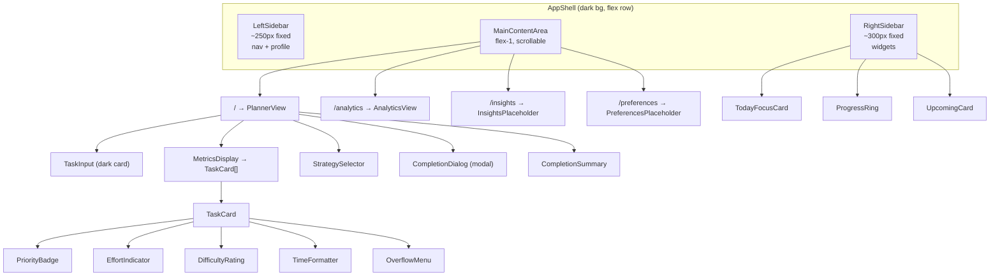
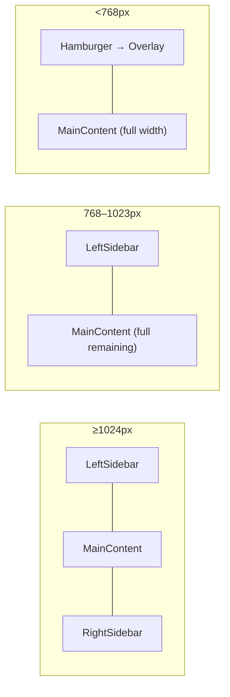

# Design Document: UI Redesign — Dark Theme Dashboard

## Overview

This design transforms the AI Daily Task Planner frontend from a light-themed, single-column layout with inline styles into a modern dark-themed, three-panel SaaS dashboard. The redesign introduces Tailwind CSS for all styling, a persistent left sidebar for navigation, a right sidebar for contextual widgets (Today's Focus, Progress Ring, Upcoming Tasks), and visual metric indicators on task cards (priority badges, effort rings, difficulty dots, time labels).

All existing functionality — task input/parsing, AI analysis, metrics display, strategy selection, completion flow, analytics dashboard, and unblocked notifications — is preserved. No backend changes are required; all API integrations remain identical.

**Key design decisions:**

- **Tailwind CSS over CSS Modules or styled-components**: Tailwind's utility-first approach aligns with the inline-style-to-class migration, keeps styles co-located with markup, and avoids introducing a CSS-in-JS runtime. The project already uses Vite, which has first-class PostCSS support.
- **Class-based dark mode (`darkMode: "class"`)**: Enables future light/dark toggle without refactoring. The `dark` class is applied to `<html>` on load.
- **New visual metric components as pure functions**: Priority badges, effort rings, difficulty dots, and time formatters are implemented as small, pure components/utilities with clear input→output contracts, making them independently testable.
- **SVG-based Progress Ring**: Replaces the linear progress bar with a donut chart using SVG `<circle>` elements with `stroke-dasharray`/`stroke-dashoffset` for arc segments. No charting library needed.

## Architecture

The application architecture remains a single-page React app with React Router. The primary structural change is the introduction of an `AppShell` layout component that wraps all routes and provides the three-panel structure.



### Responsive behavior



- **≥1024px**: All three panels visible side by side.
- **768–1023px**: Right sidebar hidden; main content fills remaining space.
- **<768px**: Left sidebar collapses to hamburger overlay with focus trap; main content full width; right sidebar content stacks below main.

## Components and Interfaces

### New Components

#### `AppShell`

The root layout component replacing the current `NavBar` + `<main>` structure.

```typescript
// No props — wraps <Outlet> from React Router
function AppShell(): JSX.Element;
```

Renders `<div className="dark">` at root, then a flex row containing `LeftSidebar`, `<Outlet />` (main content), and `RightSidebar`. Manages mobile sidebar toggle state.

#### `LeftSidebar`

```typescript
interface LeftSidebarProps {
  isOpen: boolean; // For mobile overlay state
  onClose: () => void; // Close mobile overlay
}
```

Navigation items: `{ label: string; path: string; icon: JSX.Element }[]` for Planner, Analytics, Insights, Preferences. Uses `useLocation()` to highlight active route. Renders `<nav aria-label="Main navigation">` with keyboard-focusable links. Profile section at bottom with placeholder avatar, name, email.

#### `RightSidebar`

```typescript
interface RightSidebarProps {
  tasks: AnalyzedTask[];
  completedTaskIds: Set<string>;
}
```

Container for `TodayFocusCard`, `ProgressRing`, and `UpcomingCard`. Shows empty-state placeholders when `tasks.length === 0`.

#### `TodayFocusCard`

```typescript
// No props — static motivational content
function TodayFocusCard(): JSX.Element;
```

#### `ProgressRing`

```typescript
interface ProgressRingProps {
  tasks: AnalyzedTask[];
  completedTaskIds: Set<string>;
  /** Optional: IDs of tasks currently in progress */
  inProgressTaskIds?: Set<string>;
}
```

Renders an SVG donut chart with four arc segments (Done, In Progress, Planned, Remaining). Displays centered percentage text. Below the ring: a legend with color swatches and counts, plus a summary line.

**SVG implementation**: Uses a `<circle>` per segment with computed `stroke-dasharray` and `stroke-dashoffset`. The circumference is `2 * π * radius`. Each segment's dash length = `(count / total) * circumference`.

#### `UpcomingCard`

```typescript
interface UpcomingCardProps {
  tasks: AnalyzedTask[];
  completedTaskIds: Set<string>;
}
```

Lists the next few incomplete tasks with placeholder times. Includes "View all" link and "+ Add to calendar" button.

#### `TaskCard`

```typescript
interface TaskCardProps {
  task: AnalyzedTask;
  index: number; // 1-based display index
  isCompleted: boolean;
  onMarkComplete?: (taskId: string) => void;
  allTasks: AnalyzedTask[]; // For dependency label lookup
}
```

Replaces the current `<li>` in MetricsDisplay. Contains: numbered index, status dot, title, PriorityBadge, EffortIndicator, DifficultyRating, time display, dependencies, OverflowMenu.

#### `PriorityBadge`

```typescript
interface PriorityBadgeProps {
  priority: number; // 1-5
}
```

Pure component. Maps priority to label and color:

- 4–5 → "High", red/orange icon
- 3 → "Medium", yellow icon
- 1–2 → "Low", green/blue icon

#### `EffortIndicator`

```typescript
interface EffortIndicatorProps {
  effortPercentage: number; // 0-100
}
```

Pure component. Renders a small SVG ring where the filled arc represents the effort percentage. Includes `aria-label="Effort: {N}%"`.

#### `DifficultyRating`

```typescript
interface DifficultyRatingProps {
  level: number; // 1-5
}
```

Pure component. Renders 5 dots: `level` filled, `5 - level` unfilled. Includes `aria-label="Difficulty: {N} out of 5"`.

#### `OverflowMenu`

```typescript
interface OverflowMenuProps {
  taskId: string;
  onMarkComplete?: (taskId: string) => void;
}
```

Three-dot button that opens a dropdown with "Mark Complete" and "View Details" actions. Keyboard accessible (Enter/Space to open, Escape to close). Uses `aria-haspopup="menu"` and `aria-expanded`.

### Utility Functions

#### `formatDuration`

```typescript
function formatDuration(minutes: number): string;
```

Converts minutes to human-readable format:

- `< 60` → `"{N} min"`
- `≥ 60` with no remainder → `"{H}h"`
- `≥ 60` with remainder → `"{H}h {M}m"`

#### `getProgressSegments`

```typescript
interface ProgressSegment {
  label: string;
  count: number;
  color: string;
  dashLength: number;
  dashOffset: number;
}

function getProgressSegments(
  total: number,
  completed: number,
  inProgress: number,
  circumference: number,
): ProgressSegment[];
```

Pure function that computes SVG arc segments for the progress ring.

#### `getPriorityConfig`

```typescript
interface PriorityConfig {
  label: "High" | "Medium" | "Low";
  colorClass: string;
  icon: string;
}

function getPriorityConfig(priority: number): PriorityConfig;
```

Pure function mapping priority 1–5 to display configuration.

### Modified Components

All existing components are modified to:

1. Remove all inline `style` attributes
2. Replace with Tailwind CSS utility classes
3. Use dark theme color tokens from the custom palette

The component interfaces (props, callbacks, API calls) remain unchanged. The modifications are purely presentational.

| Component               | Key Changes                                                                                                                |
| ----------------------- | -------------------------------------------------------------------------------------------------------------------------- |
| `App.tsx`               | Replaced with `AppShell` + React Router `<Outlet>`. NavBar removed. Routes expanded for Insights/Preferences placeholders. |
| `TaskInput`             | Dark card wrapper, accent button, helper text, "Get AI suggestions" button in header.                                      |
| `MetricsDisplay`        | Delegates to `TaskCard` components. "Parsed tasks" header with "Sort by" dropdown.                                         |
| `StrategySelector`      | Dark-themed button group with accent color for active state.                                                               |
| `ProgressIndicator`     | Replaced with `ProgressRing` in the right sidebar.                                                                         |
| `CompletionDialog`      | Dark modal overlay and card surfaces.                                                                                      |
| `CompletionSummary`     | Dark success card with green accent.                                                                                       |
| `AnalyticsDashboard`    | Dark surfaces, light text, accent color palette for charts.                                                                |
| `UnblockedNotification` | Dark toast with purple/blue accent border.                                                                                 |

## Data Models

No new data models are introduced. All existing TypeScript interfaces (`ParsedTask`, `AnalyzedTask`, `TaskMetrics`, `AnalyticsSummary`, etc.) remain unchanged.

The only new types are component prop interfaces and utility function return types as defined in the Components and Interfaces section above.

### Tailwind Configuration

```typescript
// tailwind.config.js — custom theme extension
{
  darkMode: "class",
  content: ["./index.html", "./src/**/*.{ts,tsx}"],
  theme: {
    extend: {
      colors: {
        'dark-bg': '#1a1a2e',
        'dark-surface': '#232342',
        'dark-card': '#2a2a4a',
        'dark-border': '#3a3a5a',
        'accent': '#7c3aed',        // violet-600
        'accent-light': '#8b5cf6',  // violet-500
        'accent-dark': '#6d28d9',   // violet-700
      }
    }
  }
}
```

## Correctness Properties

_A property is a characteristic or behavior that should hold true across all valid executions of a system — essentially, a formal statement about what the system should do. Properties serve as the bridge between human-readable specifications and machine-verifiable correctness guarantees._

The following properties target the pure utility functions and visual metric components introduced by this redesign. UI layout and styling are covered by example-based tests; these properties focus on the data transformation logic that powers the visual indicators.

### Property 1: Priority badge mapping is total and consistent

_For any_ integer priority value in the range 1–5, `getPriorityConfig(priority)` SHALL return a label of "High" for values 4–5, "Medium" for value 3, and "Low" for values 1–2, along with a non-empty color class and icon string.

**Validates: Requirements 5.4**

### Property 2: Effort indicator rendering and accessibility

_For any_ effort percentage value in the range 0–100, the `EffortIndicator` component SHALL render an SVG ring whose filled arc length equals `(effortPercentage / 100) * circumference` (within floating-point tolerance), display the numeric percentage, and include an `aria-label` of `"Effort: {N}%"` where N is the rounded percentage.

**Validates: Requirements 5.5, 10.6**

### Property 3: Difficulty rating rendering and accessibility

_For any_ difficulty level in the range 1–5, the `DifficultyRating` component SHALL render exactly 5 dots total, with exactly `level` dots filled and `5 - level` dots unfilled, and include an `aria-label` of `"Difficulty: {level} out of 5"`.

**Validates: Requirements 5.6, 10.5**

### Property 4: Duration formatting round-trip

_For any_ positive integer number of minutes, `formatDuration(minutes)` SHALL produce a string that, when parsed back (extracting hours and minutes components), yields the original number of minutes. Additionally, values under 60 SHALL produce a string matching the pattern `"{N} min"`, and values of 60 or above SHALL include an `"h"` component.

**Validates: Requirements 5.7**

### Property 5: Dependencies display completeness

_For any_ task with a `dependsOn` array, the TaskCard dependencies section SHALL display "None" when the array is empty, and SHALL display every dependency ID from the array when it is non-empty. The count of displayed dependency IDs SHALL equal the length of the `dependsOn` array.

**Validates: Requirements 5.8**

### Property 6: Progress ring arc segments sum to full circumference

_For any_ non-negative integer counts of completed, in-progress, and planned tasks (where completed + inProgress + planned ≤ total and total > 0), the `getProgressSegments` function SHALL produce arc segments whose `dashLength` values sum to exactly the full circumference of the ring (within floating-point tolerance).

**Validates: Requirements 7.2**

### Property 7: Progress ring text accuracy

_For any_ set of tasks and completed task IDs (where total > 0), the `ProgressRing` component SHALL display a percentage equal to `Math.round((completed / total) * 100)` and a summary line reading `"{completed} of {total} tasks completed"` with the correct numeric values.

**Validates: Requirements 7.3, 7.5**

## Error Handling

This redesign is purely presentational and does not introduce new error-prone operations. Existing error handling remains unchanged:

| Scenario                                                             | Current Behavior                                    | Change                                            |
| -------------------------------------------------------------------- | --------------------------------------------------- | ------------------------------------------------- |
| API call failures (parse, analyze, complete, analytics, preferences) | Error messages displayed inline with `role="alert"` | Styled with dark theme colors; behavior unchanged |
| Empty task input                                                     | "Please enter at least one task." error             | Styled with dark theme; behavior unchanged        |
| No tasks analyzed (empty state)                                      | Components show "No tasks to display"               | Right sidebar shows placeholder/empty-state cards |
| Network timeout                                                      | Axios error caught, user-facing message shown       | No change                                         |
| Invalid completion time                                              | Button disabled when input is invalid               | Styled with dark theme; behavior unchanged        |

**New error considerations:**

- **Overflow menu click outside**: Menu closes on outside click or Escape key. No error state.
- **Mobile sidebar toggle**: Managed via React state. Focus trap ensures keyboard users can dismiss.
- **SVG rendering edge cases**: Progress ring handles `total === 0` by showing an empty/placeholder state. Effort indicator clamps percentage to 0–100.

## Testing Strategy

### Unit Tests (Example-Based)

Example-based tests cover structural rendering, responsive behavior, accessibility attributes, and integration points:

- **AppShell layout**: Verify three-panel structure renders, correct CSS classes applied
- **LeftSidebar**: Verify nav items, active highlighting, profile section, `<nav>` element with `aria-label`, keyboard navigation
- **RightSidebar**: Verify widget rendering, empty-state placeholders
- **TaskCard**: Verify numbered index, status dot colors, overflow menu presence, completed state (opacity + strikethrough)
- **Responsive breakpoints**: Verify sidebar visibility at 1024px, 768px, and mobile widths
- **Accessibility**: Verify ARIA attributes on ProgressRing SVG, OverflowMenu, hamburger button
- **Dark theme application**: Verify `dark` class on root element, no inline `style` attributes in any component
- **Preserved functionality**: Regression tests confirming all existing API interactions and state management work unchanged

### Property-Based Tests

Property-based tests use `fast-check` (already a project dependency) to verify universal properties of the pure utility functions and visual metric components. Each property test runs a minimum of 100 iterations.

| Property                                   | Test Target                     | Generator                                                                           |
| ------------------------------------------ | ------------------------------- | ----------------------------------------------------------------------------------- |
| Property 1: Priority badge mapping         | `getPriorityConfig`             | `fc.integer({ min: 1, max: 5 })`                                                    |
| Property 2: Effort indicator rendering     | `EffortIndicator` component     | `fc.integer({ min: 0, max: 100 })`                                                  |
| Property 3: Difficulty rating rendering    | `DifficultyRating` component    | `fc.integer({ min: 1, max: 5 })`                                                    |
| Property 4: Duration formatting round-trip | `formatDuration`                | `fc.integer({ min: 1, max: 1440 })`                                                 |
| Property 5: Dependencies display           | `TaskCard` dependencies section | `fc.array(fc.uuid())`                                                               |
| Property 6: Progress ring arc geometry     | `getProgressSegments`           | `fc.record({ total: fc.integer({min:1,max:50}), completed: ..., inProgress: ... })` |
| Property 7: Progress ring text accuracy    | `ProgressRing` component        | `fc.array(fc.record(...))` with `fc.subarray(...)` for completed IDs                |

**Tag format**: Each property test includes a comment: `// Feature: ui-redesign-dark-theme, Property {N}: {title}`

### Smoke Tests

- Tailwind CSS is installed and `tailwind.config.js` exists with expected configuration
- Build produces CSS output containing Tailwind utility classes
- No inline `style` attributes remain in any component file (can be enforced via ESLint rule or grep check)

### Integration / Regression Tests

Existing test suites (`CompletionDialog.test.tsx`, `MetricsDisplay.test.tsx`, `ProgressIndicator.test.tsx`, `StrategySelector.test.tsx`, `TaskInput.test.tsx`) must continue to pass after the redesign. Tests may need minor updates to account for changed DOM structure (e.g., querying by `data-testid` rather than element structure), but the assertions on behavior should remain identical.
